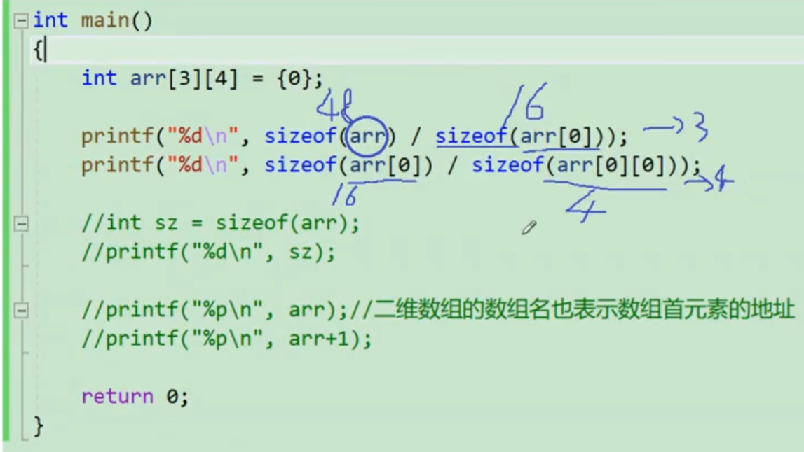

c语言的源文件以.c结尾，编译器会以c语言的语法编译.c文件
stdio.h是c语言的标准输入输出头文件，比如printf库就包含其中。
c语言规定main函数是程序的入口，main函数有且仅有一个
<!-- more -->
### c语言中的数据类型
```
char          // 1
short         // 2
int           // 4
long          // 4
long long     // 8
float         // 4
double        // 8

// 输入输出格式化函数
scanf("%4d%2d", &num1, &num2);
printf("%zu", sizeof(char)); // %zu表示sizeof返回的无符号整数值  
print("%.1f", a); // 打印小数点后一位
printf返回的打印的字符的个数  
%d 打印整型
%u 打印无符号整数 
%c 打印字符
%s 打印字符串
%f 打印float类型的数据
%lf 打印double类型的数据
%zu 打印sizeof的返回值
%2d 两位右对齐
%-2d 两位左对齐

1byte = 8bit
1 kb = 1024 b 1 mb = 1024 kb gb tb pb
```
程序everything 查询任意文件地址  
### c语言变量常量
外部符号变量声明方法：
```
a.c
int a = 10; // 全局变量
b.c
extern int a;
```
局部变量的声明周期：进入作用域开始，出作用域结束  
全局变量的生命周期：整个程序的生命周期   
C语言中的常量种类：
- 字面常量  
- const修饰的常变量，本质是变量，但不能修改  
- #define定义的标识符常量  
- 枚举常量  

### 转义字符
|转义字符|释义|
|:-:|:-:|
|\\?|在书写连续多个问号时使用，防止被解析成三字母词|
|\\'|用于表示字符常量'|
|\\"|用于表示一个字符串内部的双引号|
|\\\\ |用于表示一个反斜杠，防止被解释成转义符|
|\\a|警告字符，蜂鸣|
|\\b|退格符|
|\\f|进纸符|
|\\n|换行|
|\\r|回车|
|\\t|水平制表符|
|\\v|垂直制表符|
|\\ddd|ddd表示1-3个八进制数字|
|\\xdd|dd表示2个十六进制数字|  

### C语言操作符
算术操作符：+ - * / %(取模操作符的两个操作数必须是整数)  
移位操作符：<< >>  
位操作符： & ^ |  
赋值操作符： = += -= *= /= &= ^= |= >>= <<=  
单目运算符： ! - + &(取地址) *(解引用) ~(按位取反) -- ++ **sizeof**  (类型) (强制类型转换)
c语言中，0表示假，非0表示真  
```
sizeof(x): x在内存中所占字节大小
int arr[10] = {0};
printf("%d/n", sizeof(arr)); //40 计算的是整个数据的大小，单位为字节 
```
关系操作符：> >= < <= != ==
逻辑操作符： && ||  
条件操作符：exp1 ? exp2 : exp3  
逗号表达式：逗号隔开的遗传表达式，从左向右依次计算，整个表达式的结果是最后一个表达式的结果  
下表引用、函数调用和结构成员：[] () . ->  

### 常见关键字
```
char double float int long short signed unsigned void sizeof 
if else goto for do while switch case continue break default return
struct enum extern union typedef const auto static 
register volatile
```
```
typedef unsigned int uint_32;
typedef struct Node
{
    int data;
    struct Node* next;
}Node;  // struct Node -> Node
```
变量必须有字母、数字、下划线组成，且不能以数字开头。  
static 修饰局部变量：局部变量出了作用域不销毁，本质上，static修饰局部变量改变了变量的存储位置(栈区 --> 静态区)，改变了变量的生命周期，和程序的生命周期一样，编译期间已经分配了内存地址；  
static 修饰全局变量：全局变量是具有外部链接属性的，源文件之间可通过extern使用，但是当static修饰全局变量的时候，全局变量就变成了内部链接属性，只在当前文件中可见，其他源文件就访问不到此全局变量了；  
static 修饰函数：和全局变量类似，全局函数具有外部链接属性，源文件之间可通过extern使用，但是当static修饰全局函数时，全局函数就变成了内部链接属性，只在当前文件可见。  
```
// a.c
int Add(int x, int y) {
    return x + y;
}
// b.c
include <stdio.h>
extern int Add(int x, int y);
int main() {
    int a = 10;
    int b = 20;
    int z = a + b;
    printf("%d/n", z);
    return 0;
}
```
```
include <stdio.h>
int main() {
    register int num = 3; // 建议3存放到寄存器中
    return 0;
}
```
switch必须跟整型表达式，case必须跟整型常量表达式
```
int ch = getchar();  // getchar返回 的是int类型，如果读取错误返回的是EOF, EOF是定义的宏-1
putchar(ch);
```
MSDN win32 api查询工具
在windows系统中，ctrl+z会被当成EOF 
gets()可以读包含空格的一行
```
#include <wimdows.h>
Sleep(1000);
#include <stdlib.h>
system("cls"); //system是一个库函数，可以执行系统命令
#include <time.h>
srand((unsigned int)time(NULL)); //srand更改随机数种子
rand(); // 根据随机数种子生成随机数
```
strcmp：比较两个字符串是否相等，返回0表示两个字符串相等
strcpy
数组传参传的是数组首元素的地址
```
int main() {
again:
    print("test");
    print("test1");
    goto again;
    return 0;
}
```
goto语句不能跨函数跳转  
shutdown -s -t 60 倒计时60s关机  
shutdown -a 取消倒计时关机  
库函数查询网站： 
http://en.cppreference.com  
http://zn.cppreference.com  
一个工程里只能有一个main函数  
数组传参传递的是数组元素的首地址，所以在函数内部不能求形参数组的元素个数  
bool类型头文件 stdbool.h  
函数可以嵌套调用，但不能嵌套定义
main函数有三个参数：
```
int main(int argc, char* argv[], char* envp[])
```
静态库导入：
```
#pragma comment(lib, "add.lib")
```
C99标准之前，数组的大小都是用常量或者常量表达式来指定
C99标准之后，支持了变长数组，允许数组的大小是变量，但是这种指定方式的数组是不能初始化的  
sizeof(数组名)：这里的数组名表示整个数组的大小，计算的是整个数组的大小，单位是字节  
&数组名：取出的是整个数组的地址  

二维数组的数组名表示数组第一行的地址


### 隐式类型转换
C的整型算术运算总是至少以缺省整型类型的精度来进行的。为了获得这个精度，表达式中的字符和短整型操作数在使用之前会被转换成普通整型。**整型提升的时候原操作数是无符号数高位直接补0，有符号数高位补充符号位**  
整型提升的意义：表达式的整型运算要在CPU的相应运算器件内执行，CPU内置整型运算器(ALU)的操作数的字节长度一般就是int的字节长度，同时也是CPU的通用寄存器的长度。通用CPU是难以直接实现两个8bit位直接相加运算，所以，表达式中各种长度小于int长度的整型值，都必须先转换为int或unsigned int，然后送入CPU执行计算。  
指针是最小内存单元的编号，即地址。 
原码：直接通过正负的形式写出的二进制序列  
反码：原码符号位不变，其他位按位取反  
补码：反码+1   
整型在内存中以补码形式存储，原因在于使用补码可以将符号位和数值域统一处理，同时，加法和减法也可以统一处理。   
strlen相加减得到的结果是size_t, 即unsigned int类型，因此计算结果为负的时候会得不到预期的结果    
**有符号和无符号计算会转换成无符号计算**  
整型的取值范围定义在limits.h中，浮点型的取值范围等定义在float.h中   
### 数组&指针
二维数组传参，函数形参的设计只能省略第一维参数，因为对一个二维数组，可以不知道有多少行，但必须知道有多少列  
对于函数名来说，&函数名和函数名都是函数的地址。  
```
#include <stdio.h>
int main() {
    int a[] = { 1, 2, 3, 4 };

    printf("%d\n", sizeof(a)); // 16
    // sizeof(数组名)，数组名表示整个数组，计算的是整个数组的大小，单位是字节
    printf("%d\n", sizeof(a + 0)); // 4/8
    // a不是单独放在sizeof内部，也没有取地址，所以a就是首元素地址，a+0还是首元素地址
    printf("%d\n", sizeof(*a)); // 4
    // *a中的a是数组首元素的地址，*a就是对首元素地址的解引用，找到的就是首元素，首元素的大小为4个字节
    printf("%d\n", sizeof(a + 1)); // 4/8
    // 这里的a就是数组首元素的地址，a+1是第二个元素的地址 
    printf("%d\n", sizeof(a[1])); // 4
    // 第二个元素的大小
    printf("%d\n", sizeof(&a)); // 4/8、
    // &a取出的是数组的地址
    printf("%d\n", sizeof(*&a)); // 16
    // &a --> int(*)[4],数组指针解引用得到的数整个数组a
    printf("%d\n", sizeof(&a + 1)); // 4/8
    //  &a --> int(*)[4]，&a + 1指向a的末尾
    printf("%d\n", sizeof(&a[0])); // 4/8
    // 第一个元素的地址
    printf("%d\n", sizeof(&a[0] + 1)); // 4/8
    // 第二个元素的地址

    char arr[] = { 'a', 'b', 'c', 'd', 'e', 'f' };
    printf("%d\n", sizeof(arr)); // 6
    printf("%d\n", sizeof(arr + 0)); // 4/8
    printf("%d\n", sizeof(*arr)) // 1
    // *arr就是数组的首元素
    printf("%d\n", sizeof(arr[1])); // 1
    printf("%d\n", sizeof(&arr)); // 4/8
    printf("%d\n", sizeof(&arr + 1)); // 4/8
    printf("%d\n", sizeof(&arr[0] + 1)); // 4/8
    
    # include <string.h>
    printf("%d\n", strlen(arr)); // 随机值
    printf("%d\n", strlen(arr + 0)); // 随机值
    printf("%d\n", strlen(*arr)) // strlen('a') -> strlen(97) 野指针，错误写法
    printf("%d\n", strlen(arr[1])); // strlen('b') -> strlen(97) 野指针，错误写法
    printf("%d\n", strlen(&arr)); // 随机值
    printf("%d\n", strlen(&arr + 1)); // 随机值
    printf("%d\n", strlen(&arr[0] + 1)); // 随机值

    char arr[] = "abedef"; // a b c d e f \0
    printf("%d\n", sizeof(arr)); // 7
    printf("%d\n", sizeof(arr + 0)); // 4/8
    printf("%d\n", sizeof(*arr)) // 1
    // *arr就是数组的首元素
    printf("%d\n", sizeof(arr[1])); // 1
    printf("%d\n", sizeof(&arr)); // 4/8
    printf("%d\n", sizeof(&arr + 1)); // 4/8
    printf("%d\n", sizeof(&arr[0] + 1)); // 4/8

    printf("%d\n", strlen(arr)); // 6
    printf("%d\n", strlen(arr + 0)); // 6
    printf("%d\n", strlen(*arr)) // strlen('a') -> strlen(97) 野指针，错误写法
    printf("%d\n", strlen(arr[1])); // strlen('b') -> strlen(97) 野指针，错误写法
    printf("%d\n", strlen(&arr)); //6
    printf("%d\n", strlen(&arr + 1)); // 随机值
    printf("%d\n", strlen(&arr[0] + 1)); // 5

    char* p = "abcdef";
    printf("%d\n", sizeof(p)); // 4/8
    printf("%d\n", sizeof(p + 1)); // 4/8
    printf("%d\n", sizeof(*p)) // 1?取得是第一个元素？
    printf("%d\n", sizeof(p[0])); // 1
    printf("%d\n", sizeof(&p)); // 4/8
    printf("%d\n", sizeof(&p + 1)); // 4/8
    printf("%d\n", sizeof(&p[0] + 1)); // 4/8

    printf("%d\n", strlen(p)); // 6
    printf("%d\n", strlen(p + 1)); // 5
    printf("%d\n", strlen(*p)) // 错误写法
    printf("%d\n", strlen(p[0])); // 错误写法
    printf("%d\n", strlen(&p)); //随机值
    printf("%d\n", strlen(&p + 1)); // 随机值
    printf("%d\n", strlen(&p[0] + 1)); // 5

    int a[3][4] = {0};
    printf("%d\n", sizeof(a)); // 48
    printf("%d\n", sizeof(a[0][0])); // 4
    printf("%d\n", sizeof(a[0])); // **16, a[0]表示第一行整个一维数组的地址**，单数放在sizeof内部，表示整个一维数组
    printf("%d\n", sizeof(a[0] + 1)); // 4/8
    // a[0]没有单独放在sizeof内部，也没取地址，加1后不再代表第一行数组的地址，而是表示a[0]首元素的地址，即a[0][0]的地址->&a[0][0] + 1
    printf("%d\n", sizeof(*(a[0] + 1))); // 4
    printf("%d\n", sizeof(a + 1)); // 4/8
    // a没有单独放在sizeof内部，也没取地址，a表示的是首元素的地址，二维数组的首元素是它的第一行，a表示第一行的地址，a+1表示第二行的地址
    printf("%d\n", sizeof(*(a + 1))); // 16
    // 对第二行地址解引用
    printf("%d\n", sizeof(&a[0] + 1)); // 4/8
    // &a[0] -> 对第一行的数组名取地址，拿到的是第一行的地址，&a[0]+1得到的就是第二行的地址
    printf("%d\n", sizeof(*(&a[0] + 1))); // 16
    printf("%d\n", sizeof(*a)); // 16
    // a表示首元素的地址，即第一行的地址
    printf("%d\n", sizeof(a[3])); // 16

    return 0;
}
```
数组名的意义：
1、sizeof(数组名),这里的数组名表示整个数组，计算的是整个数组的大小
2、&数组名，这里的数组名表示整个数组，取出的是整个数组的地址
除此之外所有的数组名都表示首元素的地址。
```
Struct test
{
    int Num;
    char* pcName;
    short sDate;
    char cha[2];
    short sBa[4];
}*p = (struct Test*)0x100000;
// x86环境下，这里结构体大小是20个字节，假设p的值为0x100000
int main() {
    printf("%p\n", p+0x1);
    // p是结构体指针, 0x100000 + 20 --> 0x100014
    printf("%p\n", (unsigned long)p+0x1); // 整型+1--> 0x100001
    printf("%p\n", (unsigned int*)p+0x1); // p是无符号整型指针，0x100000 + 4 --> 0x100004
}
```
### 字符函数和字符串函数
字符串的结束标志是'\0'  
字符串比较："abc" == "acd"：比较的是两个字符串的地址，而不是字符串内容 
```
#include <string.h>
strlen:  求字符串长度，参数指向的字符串必须以'/0'结束，注意函数的返回值为size_t
char * strcpy(char * dest, const char* source); // 拷贝至'/0'
char * strcat(char * dest, const char* source); // 字符串追加，目标数据、源数据必须包含'/0'，源地址和目标地址不能相同
int strcmp(const char * str1, const char * str2); // 字符串比较函数
// 长度受限制的字符串函数
char * strncpy(char* dest, const char* src, size_t num); // 如果源字符串小于num,在目标后面追加0直到num
char * strncat(char* dest, const char* src, size_t num); // 如果源字符串小于num只会追加src内容；追加完会再追加一个'/0'
int strncmp(const char* str1, const char* str2, size_t num);

char* strstr(const char* str1, const char* str2); // 返回查找到的子串的起始地址
char* strtok(char* str, const char* seq);
/**
seq参数是个字符串，定义了用作分隔符的字符集合
第一个参数指定一个字符串，包含0个或者多个由seq字符串中一个或多个分隔符分割的标记
strtok函数找到str中的下一个标记，并将其替换成'\0',返回标记前的字符串的起始地址，strtok函数会改变被操作的字符串，所以使用strtok函数切分的字符串一般都是临时拷贝的内容并且可修改
strtok函数第一次传入不为null的字符串，函数将返回切分出来的第一段字符串，并在内部保存后续字符串的起始地址；
接着继续调用strtok,第一个参数传入numm,函数将在继续查找下一个标记并切分；
如果字符串中不存在更多的标记，则返回null指针。
**/
#include <errno.h>
char * strerror (int errnum); // 返回错误码所对应的错误信息，C语言的库函数，在执行失败的时候，都会设置错误码
eg.
int main() {
    // errno -> C语言设置的一个全局的错误码存在的变量，只要调用库函数发生错误，就会将错误码存进该变量
    FILE* pf = fopen("test.txt", "r");
    if (pf == NULL) printf("%s\n", strerror(errno));
    return 0;
}
// 字符分类函数
#include <ctype.h>
iscntrl // 任何控制字符
int isspace(int c) // 空白字符：空格‘ ’，换页‘\f’，换行'\n'，回车‘\r’，制表符'\t'或者垂直制表符'\v'
int isdigit(int c) // 十进制数字 0~9
isxdigit // 十六进制数字，包括所有十进制数字，小写字母a~f，大写字母A~F
islower // 小写字母a~z
isupper // 大写字母A~Z
isalpha // 字母a~z或A~Z
isalnum // 字母或者数字，a~z,A~Z,0~9
ispunct // 标点符号，任何不属于数字或者字母的图形字符（可打印）
isgraph // 任何图形字符
isprint // 任何可打印字符，包括图形字符和空白字
// 字符转换函数
int tolower(int c);
int toupper(int c);
// 内存函数
// memcpy 负责两块独立空间的拷贝，重叠内存的拷贝可以使用memmove
void * memcpy(void * dest, const void* src, size_t num); // 函数memcpy从src的位置开始向后复制num个字节的数据到dest的内存位置
void * memmove(void * dest, const void* src, size_t num); // 和memcpy的差别就是memmove函数处理的源内存块和目标内存块是可以重叠的
int memcmp(const void* str1, const void* str2, size_t num); // 比较从ptr1和ptr2指针开始的num个字节
void* memset(void* ptr, int value, size_t num);
```
### 结构体
结构体内存对齐：  
第一个成员在结构体变量偏移量为0的地址处；  
其他成员变量要对齐到对齐数的整数倍的地址处，对齐数= 编译器默认的一个对齐数与**该成员自身大小的较小值**，vs中默认的值为8, gcc没有默认对齐数  
**结构体总大小为最大对齐数的整数倍**，每个成员变量都有一个对齐数。  
如果嵌套了结构体，**嵌套的结构体对齐到自己的最大对齐数的整数倍处**。  
```
// 宏macro offsetof (type, member)
#include <stdio.h>
#include <stddef.h>
#pragma pack(4); // 设置默认对齐数为8
struct S1 {
    char c1;
    int num;
    char c2;
}
int main() {
    printf(offsetof(struct S1, c1));
    printf(offsetof(struct S1, c2));
    printf(offsetof(struct S1, num));
    return 0;
}
#pragma pack(4) // 取消设置的默认对齐数，还原为默认
```
为什么存在内存对齐：  
1. 平台 原因(移植原因)：不是所有的硬件平台都能访问任意地址上的任意数据的；某些硬件平台只能在某些地址处取某些特
定类型的数据，否则抛出硬件异常；
2. 性能原因：数据结构(尤其是栈)应该尽可能地在自然边界上对齐。原因在于，为了访问未对齐的内存，处理器需要作两次内存访问；而对齐的内存访问仅需要一次访问。  
  
总体来说：结构体的内存对齐是拿空间来换取时间的做法。  

位段的声明和结构体类似，有两个不同：位段的成员必须要整型，位段的成员名后面有一个冒号和一个数字  
1. 位段的成员可以是int unsigned int signed int 或者是 char （属于整形家族）类型
2. **位段在空间上是按照以4个字节（int ）或者1个字节（char ）的方式来扩展开辟的**。
3. 位段涉及很多不确定因素，位段是不跨平台的，注重可移植的程序应该避免使用位段
```
struct A {
    int _a:2;  // 表示_a只占2个比特位
    int _b:5;
    int _c:10; 
    int _d:30;
}
// 整体大小8个字节
```
位段不支持跨平台，位段在网络里用的比较多(报头)。  
联合(union)的大小至少是最大成员的大小。  
当最大成员大小不是最大对齐数的整数倍的时候，就要对齐到最大对齐数的整数倍。  
### 动态内存管理
```
// 申请一块连续可用的指定字节数的内存，返回指向该空间的指针。如果开辟失败，则返回一个NULL指针
void* malloc (size_t num);
// 动态内存的释放和回收,malloc和free都声明在 stdlib.h 头文件中
void free(void* ptr);
// calloc 函数的功能是为 num 个大小为 size 的元素开辟一块空间，并且把空间的每个字节初始化为0。
// 与函数 malloc 的区别只在于 calloc 会在返回地址之前把申请的空间的每个字节初始化为全0。
void* calloc(size_t num, size_t size);

void* realloc(void* ptr, size_t);
// ptr 是要调整的内存地址, size 调整之后新大小, 返回值为调整之后的内存起始位置
// 这个函数调整原内存空间大小的基础上，还会将原来内存中的数据移动到新的空间
// realloc在调整内存空间的是存在两种情况: 原有空间之后有足够大的空间,要扩展内存就直接原有内存之后直接追加空间，原来空间的数据不发生变化;
// 原有空间之后没有足够多的空间时，扩展的方法是：在堆空间上另找一个合适大小的连续空间来使用。这样函数返回的是一个新的内存地址
```
### 柔性数组
C99 中，结构中的最后一个元素允许是未知大小的数组，这就叫做『柔性数组』成员。  
```
typedef struct st_type
 {
 int i;
 int a[];//柔性数组成员
}type_a;
int i = 0;
type_a *p = (type_a*)malloc(sizeof(type_a)+100*sizeof(int));
 //业务处理
p->i = 100;
 for(i=0; i<100; i++)
 {
 p->a[i] = i;
 }
 free(p);
 p = NULL;
```
结构中的柔性数组成员前面必须至少一个其他成员，一定是最后一个成员；  
sizeof 返回的这种结构大小不包括柔性数组的内存。  
包含柔性数组成员的结构用malloc ()函数进行内存的动态分配，并且分配的内存应该大于结构的大
小，以适应柔性数组的预期大小。    
好处：方便内存释放；有利于访问速度。  
### 文件
每个被使用的文件都在内存中开辟了一个相应的文件信息区，用来存放文件的相关信息（如文件的名
字，文件状态及文件当前的位置等）。这些信息是保存在一个结构体变量中的。该结构体类型是有系统
声明的，取名FILE.例如，VS2013编译环境提供的 stdio.h 头文件中有以下的文件类型申明：
```
struct _iobuf {
 char *_ptr;
 int   _cnt;
 char *_base;
 int   _flag;
 int  _file; 
 int   _charbuf;
 int   _bufsiz;
 char *_tmpfname;
};
typedef struct _iobuf FILE;
```
不同的C编译器的FILE类型包含的内容不完全相同，但是大同小异。  
每当打开一个文件的时候，系统会根据文件的情况自动创建一个FILE结构的变量，并填充其中的信息，  
使用者不必关心细节。一般都是通过一个FILE的指针来维护这个FILE结构的变量，这样使用起来更加方便。
```
FILE* fopen(const char* file_name, const char* open_mode);
int fclose(FILE* stream);
```
打开模式：“r”（只读）、“w”（只写）、“a”（追加）、“rb”（只读，二进制文件）、“wb”（只写）、“ab”（追加）、“r+”（读写）、“w+”（读写）、“a+”（读写）、“rb+”（读写）、“wb+”（读写）、“ab+”（读写）  
#### 文件读写函数
```
int fgetc(FILE* stream); // 读取一个字符,读取失败返回EOF  
int fputc(int character, FILE* stream); // 写入一个字符，如果成功返回被写入的字符，如果失败返回EOF
char* fgets(char* str, int num, FILE* stream); // 读取一行数据,复制到str中，最多读num-1个字符，最后还会补一个'\0',如果成功返回str,如果失败返回空指针
int fputs(const char* str, FILE* stream); // 写入一行数据，默认追加会写在同一行，需显式添加'\n',成功返回非负值
int fscanf(FILE* stream, const char* format, ... ); // 读取格式化的数据
int fprintf(FILE* stream, const char* format, ... ); // 写入格式化的数据
size_t fread(void * ptr, size_t size, size_t count, FILE* stream); // 将count个size字节大小的元素读到ptr，返回成功读取到的元素的个数
size_t fwrite(const void* ptr, size_t size, size_t count, FILE* stream); // 将ptr开始的count个size字节大小的元素写入stream，ptr是起始地址
int fseek(FILE* stream, long int offset, int origin); // 根据文件指针的位置和偏移量来设置文件指针位置，origin表示起始位置：SEEK_SET文件开始位置，SEEK_CUR文件指针当前位置，SEEK_END文件结束位置
long int ftell(FILE* stream); // 返回当前文件指针相对于文件起始位置的偏移量
void rewind(FILE* stream); // 让文件指针的位置回到文件的起始位置
```
任何一个C程序，只要运行起来就会默认打开3个流：  
FILE* stdin - 标准输入流（键盘）scanf  
FILE* stdout - 标准输出流（屏幕）printf  
FILE* stderr - 标准错误流（屏幕）    
因此，可以利用fprintf将信息打印到屏幕上： fprintf(stdout, "%s, %d, %f\n", s.arr, s.age, a.score);  
scanf 是针对标准输入流的格式化输入语句  
printf 是针对标准输出流的格式化输出语句  
fscanf 是针对所有输入流的格式化输入语句  
fprintf 是针对所有输出流的格式化输出语句  
int sscanf(const char* str, const char* format, ... ); // 从字符串中读取格式化数据  
int sprintf(char* str, const char* format, ... ); // 将一个格式化的数据写到字符串中，本质是把格式化的数据转换成字符串  
#### 文本文件和二进制文件 
数据在内存中以二进制的形式存储，如果不加转换的输出到外存，就是二进制文件。  
如果要求在外存上以ASCII码的形式存储，则需要在存储前转换。以ASCII字符的形式存储的文件就是文
本文件。  
一个数据在内存中是怎么存储的呢？  
字符一律以ASCII形式存储，数值型数据既可以用ASCII形式存储，也可以使用二进制形式存储。
如有整数10000，如果以ASCII码的形式输出到磁盘，则磁盘中占用5个字节（每个字符一个字节），而
二进制形式输出，则在磁盘上只占4个字节（VS2013测试）。   

在文件读取过程中，不能用feof函数的返回值直接用来判断文件是否读取结束。而是应用于当文件读取结束的时候，判断失败原因是读取失败结束，还是遇到文件尾结束。  
如何判断文件读取结束：  
文本文件读取是否结束，判断返回值是否为EOF （fgetc ），或者 NULL （fgets ）  
二进制文件的读取结束判断，判断返回值是否小于实际要读的个数(fread)。
```
#include <stdio.h>
#include <stdlib.h>
int main(void)
{
    int c; // 注意：int，非char，要求处理EOF
    FILE* fp = fopen("test.txt", "r");
    if(!fp) {
        perror("File opening failed");
        return EXIT_FAILURE;
    }
    //fgetc 当读取失败的时候或者遇到文件结束的时候，都会返回EOF
    while ((c = fgetc(fp)) != EOF) // 标准C I/O读取文件循环
    { 
        putchar(c);
    }
    //判断是什么原因结束的
    if (ferror(fp))
        puts("I/O error when reading");
    else if (feof(fp))
        puts("End of file reached successfully");
    fclose(fp);
}
```
文件缓冲区: ANSIC 标准采用“缓冲文件系统”处理的数据文件的，所谓缓冲文件系统是指系统自动地在内存中为程序
中每一个正在使用的文件开辟一块“文件缓冲区”。从内存向磁盘输出数据会先送到内存中的缓冲区，装
满缓冲区后才一起送到磁盘上。如果从磁盘向计算机读入数据，则从磁盘文件中读取数据输入到内存缓
冲区（充满缓冲区），然后再从缓冲区逐个地将数据送到程序数据区（程序变量等）。缓冲区的大小根
据C编译系统决定的。  
**因为有缓冲区的存在，C语言在操作文件的时候，需要做刷新缓冲区或者在文件操作结束的时候关闭文
件。如果不做，可能导致读写文件的问题.** fflush刷新缓冲区，fclose在关闭文件的时候，也会刷新缓冲区
```
#include <stdio.h>
#include <windows.h>
//VS2013 WIN10环境测试
int main()
{
 FILE*pf = fopen("test.txt", "w");
 fputs("abcdef", pf);//先将代码放在输出缓冲区
 printf("睡眠10秒-已经写数据了，打开test.txt文件，发现文件没有内容\n");
 Sleep(10000);
 printf("刷新缓冲区\n");
 fflush(pf);//刷新缓冲区时，才将输出缓冲区的数据写到文件（磁盘）
 //注：fflush 在高版本的VS上不能使用了
 printf("再睡眠10秒-此时，再次打开test.txt文件，文件有内容了\n");
 Sleep(10000);
 fclose(pf);
 //注：fclose在关闭文件的时候，也会刷新缓冲区
 pf = NULL;
}
```
### 预处理
#### 预定义符号
```
__FILE__  //进行编译的源文件     
__LINE__  //文件当前的行号  
__DATE__  //文件被编译的日期  
__TIME__  //文件被编译的时间  
__STDC__  //如果编译器遵循ANSI C，其值为1，否则未定义
```
#define 定义标识符: #define name  stuff  
#define 机制包括了一个规定，允许把参数替换到文本中，这种实现通常称为宏（macro）或定义宏（define macro）。  
#define 定义宏: #define name( parament-list ) stuff   
参数列表的左括号必须与name紧邻, 如果两者之间有任何空白存在，参数列表就会被解释为stuff的一部分  
#define DOUBLE( x)   ( ( x ) + ( x ) ) 用于对数值表达式进行求值的宏定义都应该用这种方式加上括号，避免在使用宏时由于参数中的操作符或邻近操作符之间不可预料的相互作用  
续行符\之后不能有其他内容，续行符的本质是转义换行符   
#define 替换规则：  
1. 在调用宏时，首先对**参数**进行检查，看看是否包含任何由#define定义的符号。如果是，它们首先被替换。
2. 替换文本随后被插入到程序中原来文本的位置。对于宏，参数名被他们的值所替换。
3. 最后，再次对结果文件进行扫描，看看它是否包含任何由#define定义的符号。如果是，就重复上述处理过程  

宏**参数和#define 定义**中可以出现其他#define定义的符号。但是对于宏不能出现递归宏  
当预处理器搜索#define定义的符号的时候，字符串常量(引号中的内容)的内容并不被搜索；  

**#可以把一个宏参数变成对应的变量字符串**：#define PRINT(N, FORMAT) printf("the value of "#N" is "FORMAT"\n", N) PRINT(a, "%d")   
**##可以把宏定义中位于它两边的符号合成一个符号**，它允许宏定义从分离的文本片段创建标识符。这样的连接必须产生一个合法的标识符。否则其结果就是未定义的。
```
#define ADD_TO_SUM(num, value) \
 sum##num += value;
int sum5 = 1;
ADD_TO_SUM(5,10); //作用是：给sum5增加10
```
当宏参数在宏的定义中出现超过一次的时候，如果参数带有副作用，那么你在使用这个宏的时候就可能出现危险，导致不可预测的后果.宏比函数在程序的规模和速度方面更胜一筹,宏是不受类型限制的；但宏是没法调试的。  
#undef NAME 用于移除一个宏定义  
### 条件编译
```
1.
 #if 常量表达式 //常量表达式由预处理器求值。
    //...
 #endif
如：
#define __DEBUG__ 1
 #if __DEBUG__
    //..
 #endif

 2.多个分支的条件编译
#if 常量表达式
    //...
#elif  常量表达式
    //...
#else
    //...
#endif

 3.判断是否被定义
#if defined(symbol)
#ifdef symbol

#if !defined(symbol)
#ifndef symbol

 4.嵌套指令
#if defined(OS_UNIX)
    #ifdef OPTION1
        unix_version_option1();
    #endif
    #ifdef OPTION2
        unix_version_option2();
    #endif
#elif defined(OS_MSDOS)
    #ifdef OPTION2
        msdos_version_option2();
    #endif
#endif
```
### 文件包含
本地文件包含： #include "filename.h", 查找策略：先在源文件所在目录下查找，如果该头文件未找到，编译器就像查找库函数头文件一样在标
准位置查找头文件。如果找不到就提示编译错误。
库文件包含：#include <filename.h>, 查找头文件直接去标准路径下去查找，如果找不到就提示编译错误。  
因此，对于库文件，也可以使用""包含，但是这样做查找的效率就低些，也不容易区分是库文件还是本地文件了。  
offsetof宏实现：
```
#define OFFSETOF(type, name) (size_t)&(*((type*)0)->name)
```