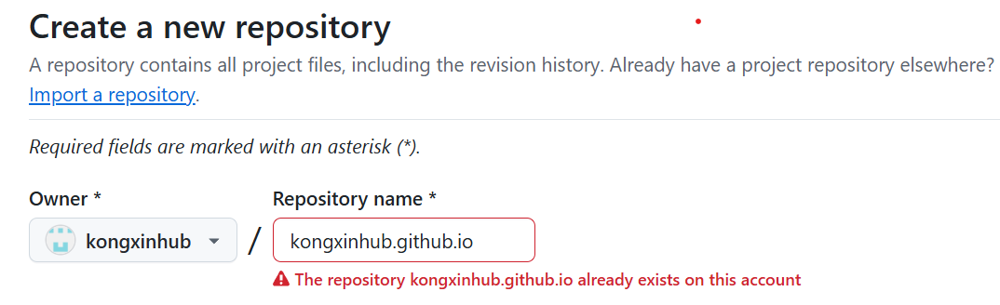
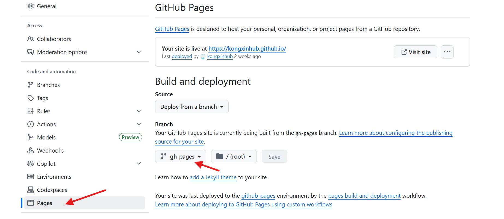
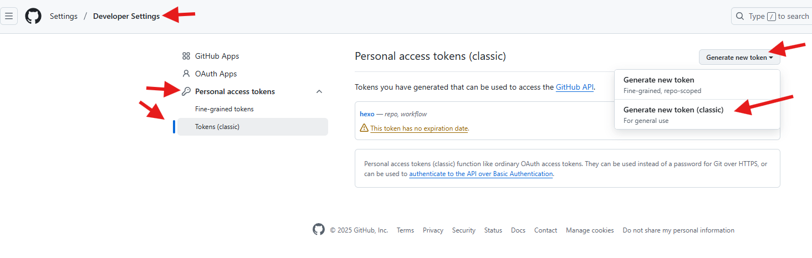
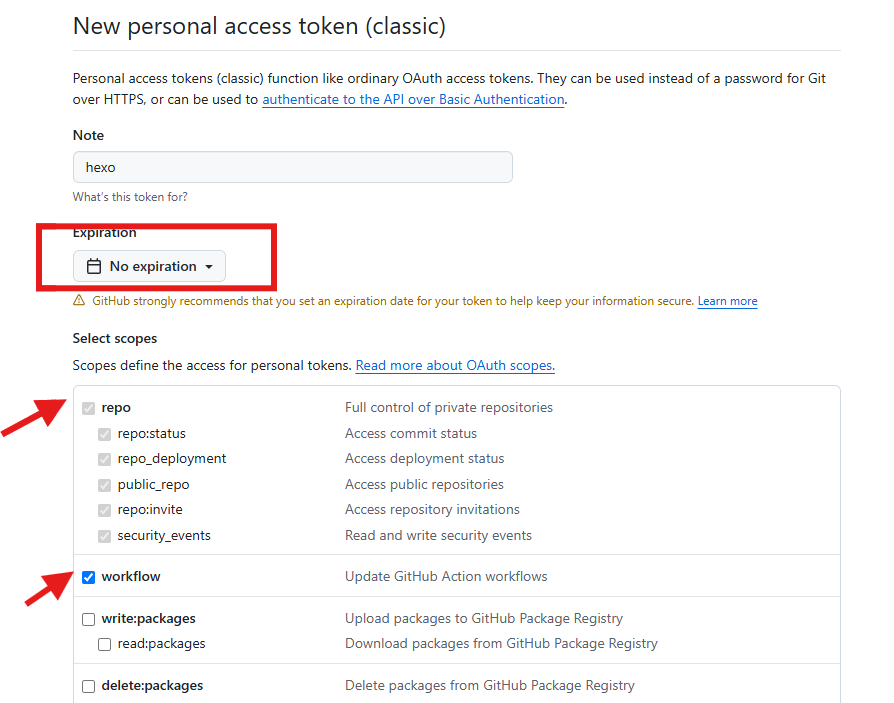
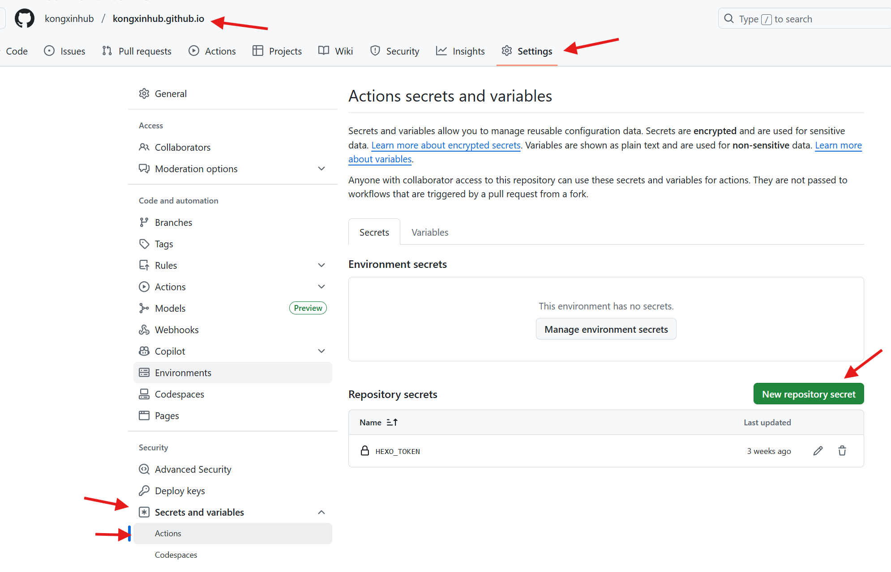
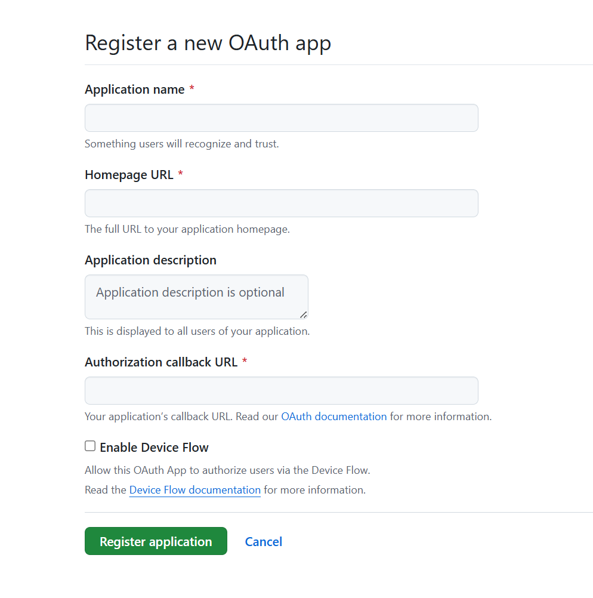

## Hexo + Github pages 个人博客自动化部署记录
本文记录了搭建个人博客的详细过程，参考了以下三篇博客:  
参考文档：  
[2024最完整Hexo+Github博客搭建教程](https://dayuzy.com/2024%E4%BF%9D%E5%A7%86%E7%BA%A7Hexo.html#%E7%AC%AC%E4%B8%80%E9%83%A8%E5%88%86-%E6%90%AD%E5%BB%BAhexo%E5%B9%B6%E9%83%A8%E7%BD%B2%E5%88%B0GitHub)  
[Hexo+Github博客搭建教程](https://blog.csdn.net/qq_58608526/article/details/124652412)  
[如何优雅的使用Github Action服务来将Hexo部署到Github Pages](https://xiamu-ssr.github.io/Hexo/2024/06/19/2024-H1/2024-06-19-12-31-52/?t=1749481451390)

### 1. 简介
本博客基于开源node库hexo搭建, Hexo是高效的静态网站生成框架，它基于Node.js，然后直接部署到github pages平台上，GitHub Pages是GitHub提供的一种免费的静态网页托管服务。
<!-- more -->
### 2. 环境准备
#### 2.1 创建 github 库
参考：[GitHub Pages官网文档](https://docs.github.com/zh/pages/quickstart)  
首先新建一个和用户名相同的仓库，即 用户名.github.io , 这样将来部署到Github pages的时候才会被识别，网址名为 https://xxxx.github.io/, xxx为github用户名  

然后进入仓库主页，点击 Settings -> Pages -> Build and deployment, 将 github pages 的部署分支设置为 gh-pages , 当然你也可以设置为其他分支，将来将网页源代码推送至该分支即可。
  

#### 2.2 生成 hexo 环境
hexo是基于node.js编写的node包，npm是node包管理工具，所以需要先安装 node.js 和 npm ，然后通过npm来安装hexo。  
linux 命令行安装：
```
sudo apt-get install git 
sudo apt-get install nodejs
sudo apt-get install npm
git --version
node -v
npm -v
```
安装完nodejs和npm之后，进入到之前创建的github仓库文件夹下(你也可以新建一个空的project用来存放hexo源代码)，切到 master 分支(也可以先在dev分支开发，开发完成后再推到master分支)，安装并初始化hexo:  
```
npm install -g hexo-cli  // 安装 hexo
hexo -v                  // 查看 hexo 是否安装成功
hexo init                // 初始化 hexo
npm install              // 安装必要组件
```
这里可能会报.git冲突错误，解决方案是hexo init时额外指定文件夹，例如 hexo init blog，再进入到blog文件夹下执行npm instal，(这一步可选)然后再把blog下的内容拷贝到根目录, 若不拷贝则博客源代码均在blog文件夹下
初始化完成后，代码仓下应该有如下目录:    
    - node_modules: nodeJS模块库  
    - scaffolds: 模板文件夹，生成文章、草稿、页面的默认模板  
    - source: 源文件  
    - themes: 主题文件夹  
    - public: 生成的网页文件目录  
    - _config.yml: hexo 配置文件  
    - _config.landscape.yml  
    - package.json  
    - package-lock.json  

此时输入 hexo g (hexo generate) 即可生成 hexo 的默认静态页面， 然后输入 hexo s (hexo server)即可打开本地服务器, 然后浏览器访问 http://localhost:4000/  
本地服务器开启后修改配置文件会实时读取
#### 2.3 关联 hexo 和 github
在 _config.yml 中修改 deploy 字段，指定 hexo 的部署地址和部署分支
```
deploy:
  type: git
  repo: https://github.com/yourusername/yourusername.github.io.git
  branch: gh-pages
```
repository 修改为你自己的github项目地址, branch 为你的部署分支，上述配置告诉工具将生成的网页代码通过git方式上传到对应链接的仓库中  
此时若想直接本地直接部署网页博客，需先安装deploy-git:  
```
npm install hexo-deployer-git --save
```  
然后执行:  
```
hexo clean     // 清除之前生成的东西
hexo generate  // 生成静态页面
hexo deploy    // 部署到 github
```  
deploy时可能需要输入github用户名和密码，等github自动部署成功后就可以在http://yourname.github.io 这个网站看到你的博客了。  

### 3. 配置Github Action工作流自动化部署网页
上述本地部署方式是在本地添加博文之后，通过 hexo g 命令在本地编译出网站的静态文件，然后通过 hexo d 将生成的网站的静态文件推送到了gh-pages 分支上, 然后github pages功能会自动触发将你的网站部署到互联网上，，但是如此你的 Hexo 源码(包括博文的md等文件)都还在本地没有云端备份，且每次发表博文都需要手动编译再推送。因此这里引入github action工作流让hexo借助github action工作流自动编译并推送到部署分支。
#### 3.1 创建自动化部署token
首先需要创建一个 token 供 Github Action 使用，在个人设置中新增一个 Personal access tokens。打开自己的 github 主页，点击右上角头像选择 Settings -> Developer Settings -> Personal access tokens -> Tokens(classic) -> Generate new token (classic):  
  
node 为 token 的名字, Expiration 为 token 过期时间，Select scopes 将 repo 和 workflow 选上，然后记下生成的 token 密钥。
 
然后将上述 token 加入到准备存放 Hexo 源代码的仓库里，打开代码仓，点击 Settings -> Secrets and variables -> Actions -> New repository secret, 将上面创建的 token 的密钥填进 Secret ，密钥名称自己随意命名  

我的 token 名称为 HEXO_TOKEN, 仓库就是上面创建的 用户名.github.io 代码仓，因为我的hexo源代码和编译后的网页代码都保存在此仓库，不过分属于不同分支，hexo源代码放在master分支,网页代码放在了部署分支gh-pages上。 
#### 3.2 配置 github action 工作流
在.github文件夹下新增workflows文件夹，然后新增deploy.yml文件，内容如下:  
```
name: Deploy Hexo to GitHub Pages

on:
  push:
    branches:
      - master  # 当推送到 master 分支时触发工作流

jobs:
  build:
    runs-on: ubuntu-latest

    steps:
      - name: Checkout repository
        uses: actions/checkout@v2
        with:
          submodules: false  # 禁用子模块检查

      - name: Setup Node.js
        uses: actions/setup-node@v2
        with:
          node-version: 'v18.19.1'

      - name: Install Dependencies
        run: npm install

      - name: Install Hexo Git Deployer
        run: |
          npm install hexo-deployer-git --save
          npm install hexo-cli -g

      - name: Clean and Generate Static Files
        run: |
          hexo clean
          hexo generate

      - name: Configure Git
        run: |
          git config --global user.name 'github-actions[bot]'
          git config --global user.email 'github-actions[bot]@users.noreply.github.com'

      - name: Deploy to GitHub Pages
        env:
          HEXO_TOKEN: ${{ secrets.HEXO_TOKEN }}
        run: |
          cd public/
          git init
          git add -A
          git commit -m "Create by workflows"
          git remote add origin https://${{ secrets.HEXO_TOKEN }}@github.com/kongxinhub/kongxinhub.github.io.git
          git push origin HEAD:gh-pages -f
``` 
其中node-version的版本号与本地初始化hexo源代码使用的版本保持一致，最后一步部署部分的token名称指定为你上一步创建的token名称。  
将刚才的更新推送至远程分支，我这里就是 用户名.github.io 仓库的 master 分支，打开github仓库主页，就可以看到 github action 工作流被自动触发，gh-pages分支会多一次提交记录，网页被更新。

### 4. Hexo 基本配置
hexo框架的一些基本配置
#### 4.1 hexo基础配置文件
项目根目录下的_config.yml文件是整个hexo的配置文件，其中部分参数的作用如下：
|参数|作用|
|:-:|:-:|
|title|网站标题|
|subtitle|网站副标题|
|description|网站描述|
|keywords|网站关键词|
|author|文章作者名|
|language|网站使用语言，常见的有zh-Hans和zh-CN|
|timezone|网站时区|
|url|网站域名|
|root|网站根目录|
|permalink|生成某个文章时的链接格式|
|theme|主题设置，网上有很多不同的主题|  
#### 4.2 hexo文章初始化模版
hexo有三种默认的布局（文章类型）：post、page和draft,他们都存储在source目录下，但分属于不用的子目录，例如post类型的文章都存储在source/_post文件夹下，其他自定义的布局也都存放在source/_posts目录下。  
创建一篇文章的命令如下：  
```
hexo new [layout] xxx
```
layout对应的就是哪种布局，当这个参数省略时，默认创建post类型，也可以通过修改_config.yml中的default_layout字段来指定默认布局，page表示创建一个页面，draft表示创建一个草稿，如果你想写一篇文章，但不想不被看到，可以创建一个草稿，如果在写作过程中想要预览一下，可以执行：
```
hexo server --draft
```
即可在本地端口开启预览。  
如果想把草稿文件发布到post,可以执行：
```
hexo publish draft xxx
```
就会把xxx.md发布到post中。  
Hexo将不同布局的模板放置在scaffolds文件夹下，可以根据需要修改对应的md模版文件。 
#### 4.3 URL
生成的文章的链接格式可以通过_config.yml的url和permalink字段指定，其原格式如下：
```
permalink: :year/:month/:day/:title/
```
上面的路径我们可以自定义，例如：
```
url: https://yourname.github.io/project
root: /
permalink: :title.html
permalink_defaults:
  lang: en
```
#### 4.4 插入图片设置
插入图片的方式有两种，一种是将所有图片放在一个目录下，比如将图像都放在source目录的images目录下面，那么在文章中引用如下：
```

```
这种方式图片多了不容易管理，还可以按文章每个文章单独开个文件夹放图片，需要修改_config.yml的文件内容如下：
```
## 文章资源文件夹
post_asset_folder: true
marked:
#省略根路径符合 "./"
  prependRoot: true 
#文章资源  
  postAsset: true
```
这样在用hexo new命令新建一篇文章的时候，会自动在source目录下创建一个md文件和对应的文件夹，文件夹的名称就是文章名称。如果要是用的Typora写markdown文章，开头的Front-matter应该指定路径: ./titlename/  
#### 4.5 添加404页面
设置404页面，当网页加载错误时可以跳转到404页面。在source文件夹下新建文件404.md, 或者新建一个404文件夹，在该文件夹下新建index.md, 然后输入以下内容：
```
---
title: 404
date: 2025-07-09 23:00:10
type: 404
layout: 404
comments: false
description: "Oops～，我崩溃了！找不到你想要的页面 :("
---

<center>
    对不起，您所访问的页面不存在或者已删除,你可以<a target="_blank" href="https://blog.zhujian.life/">点击此处</a>返回首页
</center>
```
如果使用新的网址，可以利用404进行重定向。
### 4.6 添加标签、分类和about页
在source目录下分别创建categories tags和 about文件夹，每个文件夹下创建index.md，内容如下：
```
---
title: 所有分类
date: 2019-01-23 23:26:43
type: categories
comments: false
---
```
#### 4.7 添加首页置顶
在_config.yml设置如下选项：
```
# Home page setting
# path: Root path for your blogs index page. (default = '')
# per_page: Posts displayed per page. (0 = disable pagination)
# order_by: Posts order. (Order by date descending by default)
index_generator:
  path: ''            # 文章起始页面路径
  per_page: 10        # 每页显示文章数量
  order_by: -date     # 排序（默认按日期降序）
```  
在文章的Front Matter中添加参数sticky即可实现首页置顶，数字越大排序越高(升序排序)  
### 5. Next主题配置
首先进入到themes目录下，通过git命令下载Next主题：
```
git clone https://github.com/next-theme/hexo-theme-next themes/next
```
然后修改Hexo _config.yml文件，配置当前使用主题：
```
# Extensions
## Plugins: https://hexo.io/plugins/
## Themes: https://hexo.io/themes/
# theme: landscape
theme: next
```
#### 5.1 语言设置
Next支持的语言可查看/themes/next/languages/目录下的文件，语言设置在Hexo _config.yml文件中：
```
language: zh-CN
```
#### 5.2 布局设置
NexT提供了4种布局，在NexT _config.yml文件中修改:
```
# Schemes
# scheme: Muse
# scheme: Mist
# scheme: Pisces
scheme: Gemini
```
#### 5.3 文章阅读全文设置
在文章的md文件中，在你想要简略展示的地方添加如下代码：
```
<!-- more -->
```
这样首页的简略展示只会显示此命令以上的内容。  
#### 5.4 文章菜单设置
通过配置Next _config.yml文件控制博客主页显示哪些菜单：
```
# Usage: `Key: /link/ || icon`
# Key is the name of menu item. If the translation for this item is available, the translated text will be loaded, otherwise the Key name will be used. Key is case-sensitive.
# Value before `||` delimiter is the target link, value after `||` delimiter is the name of Font Awesome icon.
# External url should start with http:// or https://
menu:
  home: / || fa fa-home
  about: /about/ || fa fa-user
  tags: /tags/ || fa fa-tags
  categories: /categories/ || fa fa-th
  archives: /archives/ || fa fa-archive
  # schedule: /schedule/ || fa fa-calendar
  # sitemap: /sitemap.xml || fa fa-sitemap
  # commonweal: /404/ || fa fa-heartbeat

# Enable / Disable menu icons / item badges.
menu_settings:
  icons: true
  badges: true
```
#### 5.5 头像设置
头像的设置在Next _config.yml中的如下字段：
```
# Sidebar Avatar
avatar:
  # Replace the default image and set the url here.
  url: #/images/avatar.gif
  # If true, the avatar will be dispalyed in circle.
  rounded: false
  # If true, the avatar will be rotated with the cursor.
  rotated: false
```
url：图像地址。默认为NexT包下/source/images/avatar.gif，因此修改头像也可以直接修改这个图像。  
rounded：是否显示为圆形图标  
rotated：光标移动到图标是否旋转  
#### 5.6 社交链接
在Next _config.yml中的如下字段：
```
# Social Links
# Usage: `Key: permalink || icon`
# Key is the link label showing to end users.
# Value before `||` delimiter is the target permalink, value after `||` delimiter is the name of Font Awesome icon.
social:
  GitHub: https://github.com/yourname || fab fa-github
  #E-Mail: mailto:yourname@gmail.com || fa fa-envelope
  #Weibo: https://weibo.com/yourname || fab fa-weibo
  #Twitter: https://twitter.com/yourname || fab fa-twitter
  #FB Page: https://www.facebook.com/yourname || fab fa-facebook
  #StackOverflow: https://stackoverflow.com/yourname || fab fa-stack-overflow
  #YouTube: https://youtube.com/yourname || fab fa-youtube
  #Instagram: https://instagram.com/yourname || fab fa-instagram
  #Skype: skype:yourname?call|chat || fab fa-skype
```
key值是显示的选项名，||前面表示链接的地址，||后面表示图标，可通过Font Awesome库自定义，Font Awesome是NexT主题的图标库
#### 5.7 标题列表
NexT可根据Markdown文件的标题设置，在侧边栏显示相应的目录
```
# Table of Contents in the Sidebar
# Front-matter variable (unsupport wrap expand_all).
toc:
  enable: true                                  # 是否开启目录
  # Automatically add list number to toc.
  number: true                                  # 自动增加列表数，比如`1.1 1.2 1.3`
  # If true, all words will placed on next lines if header width longer then sidebar width.
  wrap: false                                   # 标题内容大于侧边栏宽，是否再下一行显示
  # If true, all level of TOC in a post will be displayed, rather than the activated part of it.
  expand_all: false                             # 是否自动扩展所有列表，而不是仅扩展当前二级标题下的列表
  # Maximum heading depth of generated toc.
  max_depth: 6
```
#### 5.8 返回顶部设置
在Next _config.yml中的如下字段：
```
back2top:
  enable: true                   # 在右下角显示返回顶部图标
  # Back to top in sidebar.     
  sidebar: true                  # 在侧边栏显示
  # Scroll percent label in b2t button.
  scrollpercent: true            # 是否显示进度
```
#### 5.9 版权信息设置
在Next _config.yml中的如下字段：
```
# Creative Commons 4.0 International License.
# See: https://creativecommons.org/about/cclicenses/
creative_commons:
  # Available values: by | by-nc | by-nc-nd | by-nc-sa | by-nd | by-sa | cc-zero
  license: by-nc-sa
  # Available values: big | small
  size: small
  # 网站左侧版权信息
  sidebar: false          # 是否显示在侧边栏
  # 文章版权信息
  post: false             # 是否在文章底部显示
  # You can set a language value if you prefer a translated version of CC license, e.g. deed.zh
  # CC licenses are available in 39 languages, you can find the specific and correct abbreviation you need on https://creativecommons.org
  language: zh-CN
```
#### 5.10 文章打赏设置
在Next _config.yml中的如下字段：
```
# Donate (Sponsor) settings
# Front-matter variable (unsupport animation).
reward_settings:
  # If true, a donate button will be displayed in every article by default.
  enable: false
  animation: false
  #comment: Buy me a coffee

reward:
  #wechatpay: /images/wechatpay.png #微信
  #alipay: /images/alipay.png #支付宝
  #paypal: /images/paypal.png #PayPal
  #bitcoin: /images/bitcoin.png #比特币
```
字段设置为true，将支付截图放到对应路径下。  
#### 5.11 网页加载进度条设置
在Next _config.yml中的如下字段：
```
# Progress bar in the top during page loading.
# For more information: https://github.com/CodeByZach/pace
pace:
  enable: false
  # All available colors:
  # black | blue | green | orange | pink | purple | red | silver | white | yellow 进度条颜色
  color: blue
  # All available themes: 进度条样式
  # big-counter | bounce | barber-shop | center-atom | center-circle | center-radar | center-simple
  # corner-indicator | fill-left | flat-top | flash | loading-bar | mac-osx | material | minimal
  theme: minimal
```
#### 5.12 文章搜索设置
NexT提供了本地搜索服务和在线搜索服务，本地搜索需要使用node生成一个search.xml文件，依赖hexo-generator-searchdb包：
```
npm install hexo-generator-searchdb --save
```
然后在Hexo _config.yml文件底部添加：
```
# hexo-generator-searchdb
search:
  #要检索的文件
  path: search.xml
  #检索范围
  field: post
  format: html
  #是否检索内容
  content: false
  limit: 10
```
然后在Next _config.yml文件中修改：
```
# Algolia Search 在线搜索
# For more information: https://www.algolia.com
algolia_search:
  enable: false
  hits:
    per_page: 10

# Local Search
# Dependencies: https://github.com/next-theme/hexo-generator-searchdb
local_search:
  enable: true
  # If auto, trigger search by changing input.
  # If manual, trigger search by pressing enter key or search button.
  trigger: auto
  # Show top n results per article, show all results by setting to -1
  top_n_per_article: 1
  # Unescape html strings to the readable one.
  unescape: false
  # Preload the search data when the page loads.
  preload: false
```
#### 5.13 字数统计设置
借助hexo-word-counter库可以统计文章的字数以及预期阅读时间。完成配置后，可以在每篇文章开头和页面底部显示字数和阅读时间，首先npm 安装需求库：
```
npm install hexo-word-counter
hexo clean
```
然后在Hexo _config.yml文件底部添加：
```
# https://github.com/next-theme/hexo-word-counter 字数统计
symbols_count_time:
  # 每篇文章前显示
  symbols: true
  time: true
  # 网站底部显示
  total_symbols: false
  total_time: false
  exclude_codeblock: false
  # 平均字节长度（Average Word Length）。默认为4 如果文章中大多中文，那么设置awl为2，wpm为300比较合适
  awl: 2
  # wpm – 每分钟阅读字数（Words Per Minute）。默认为275
  wpm: 275
  suffix: "mins."
```
然后在Next _config.yml文件中修改： 
```
# Post wordcount display settings
# Dependencies: https://github.com/next-theme/hexo-word-counter
symbols_count_time:
  separated_meta: true
  #文章中的显示是否显示文字提示，否则只显示图标（本文字数|阅读时长） 
  item_text_post: true
  #网页底部的显示是否显示文字（站点总字数|站点阅读时长） 
  item_text_total: false
```
#### 5.15 不蒜子文章阅读次数设置
NexT主题已集成了不蒜子的访客人数和文章阅读统计功能，修改NexT _config.yml如下字段：
```
# Show Views / Visitors of the website / page with busuanzi.
# For more information: http://ibruce.info/2015/04/04/busuanzi/
busuanzi_count:
  enable: true
  total_visitors: true             # 在首页显示文章的阅读次数
  total_visitors_icon: fa fa-user
  total_views: true                # 点击全文阅读显示阅读次数
  total_views_icon: fa fa-eye
  post_views: true                 在底部可以看见访客人数和文章阅读次数
  post_views_icon: far fa-eye
```
#### 5.16 Gitalk 评论系统
Next集成了多种评论系统，这里只介绍如何配置Gitalk，gitalk是一个基于github开发的评论插件，它将文章评论以issues形式保存在github仓库中，因此必须登录github才可以评论。  
首先需要创建一个新的github OAuth application, 点击个人头像，选择Settings->Developer settings->OAuth Apps->new OAuth app  

Application name随便取个名字，Homepage URL可以填你的博客网页地址，也可以新建一个github仓库专门用来记录评论，这个地方就填该仓库的地址，Authorization callback URL填你的博客网页地址，注册成功后会生成Client ID和Client Secret。  
然后修改NexT _config.yml中的以下字段：
```
# ---------------------------------------------------------------
# Comments Settings
# See: https://theme-next.js.org/docs/third-party-services/comments
# ---------------------------------------------------------------

# Multiple Comment System Support
comments:
  # Available values: tabs | buttons
  style: tabs
  # Choose a comment system to be displayed by default.
  # Available values: disqus | disqusjs | changyan | livere | gitalk | utterances
  # 激活
  active: gitalk
  # Setting `true` means remembering the comment system selected by the visitor.
  storage: true
  # Lazyload all comment systems.
  lazyload: false
  # Modify texts or order for any naves, here are some examples.
  nav:
    #disqus:
    #  text: Load Disqus
    #  order: -1
    #gitalk:
    #  order: -2
```
配置gitalk:
```
# Gitalk
# For more information: https://gitalk.github.io
gitalk:
  enable: true
  github_id: github账户名 # GitHub repo owner
  repo:  xxx # Repository name to store issues 
  client_id: 上面申请的ID # GitHub Application Client ID
  client_secret: 上面申请的OA密钥 # GitHub Application Client Secret
  admin_user: github账户名 # GitHub repo owner and collaborators, only these guys can initialize gitHub issues
  distraction_free_mode: true # Facebook-like distraction free mode 是否启用快捷键(cmd|ctrl + enter) 提交评论
  # When the official proxy is not available, you can change it to your own proxy address
  proxy: https://cors-anywhere.azm.workers.dev/https://github.com/login/oauth/access_token # This is official proxy address
  # Gitalk's display language depends on user's browser or system environment
  # If you want everyone visiting your site to see a uniform language, you can set a force language value
  # Available values: en | es-ES | fr | ru | zh-CN | zh-TW
  language: zh-CN
```
注意repo填入的是github仓库名而不是仓库地址，设置完成后，将会在每篇文章末尾添加评论框，刚开始需要登录github账号进行初始化；而对于标签页/类别页等不需要评论的文章，可在front-matter设置属性进行隐藏
```
comments: false
```
[gitalk错误解决参考](https://hexo-next.readthedocs.io/zh-cn/latest/next/advanced/gitalk-%E8%AF%84%E8%AE%BA%E7%B3%BB%E7%BB%9F/)  
以上便是github pages个人博客的详细搭建记录。