## 前置知识
### 线性代数
标量就是一个数，只有大小，没有方向；向量是一组标量排列而成，只有一个轴，沿着行或者列方向。
  
<!-- more -->
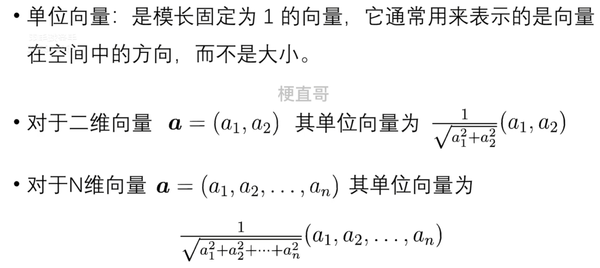

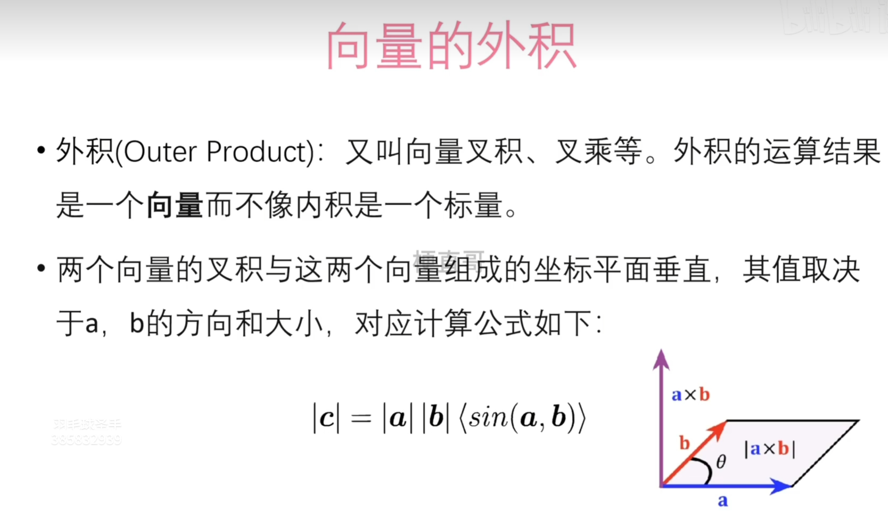
矩阵转置：以对角线为轴，进行镜像翻转 $A^T_{m,n} = A_{n,m}$  


张量是多维数组的抽象概括，可以看作是向量和矩阵的推广，向量和矩阵的运算方法对张量同样适用。 
### 微积分

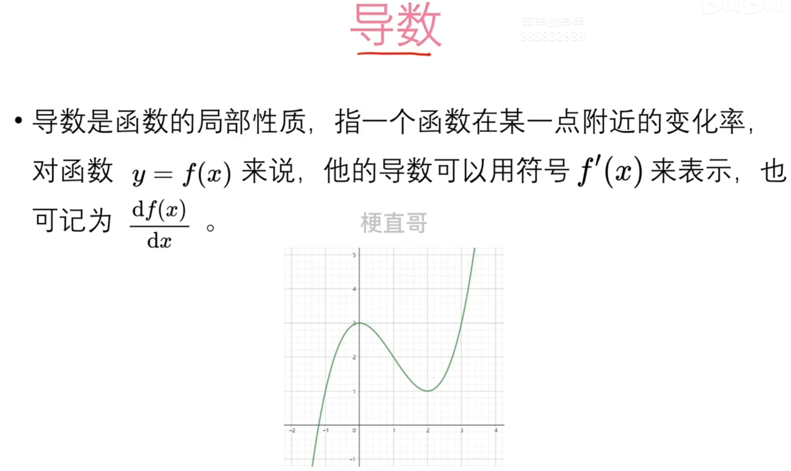
变化率为0的点就是函数的极值点
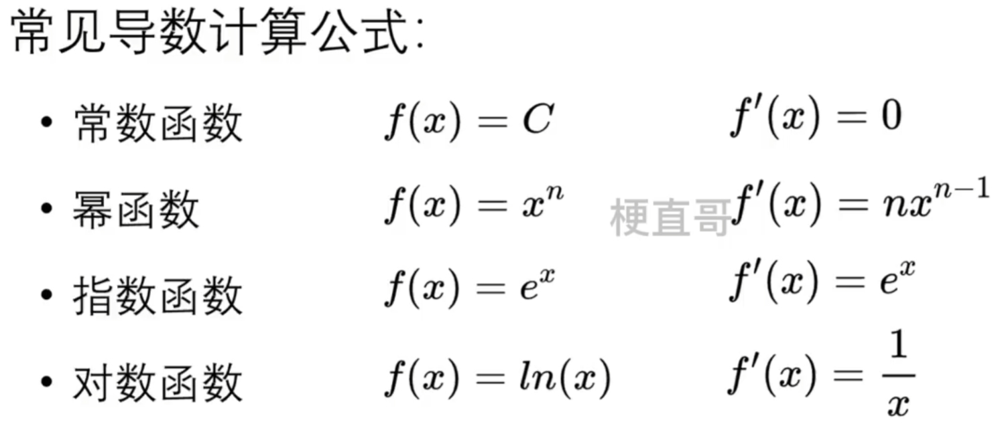

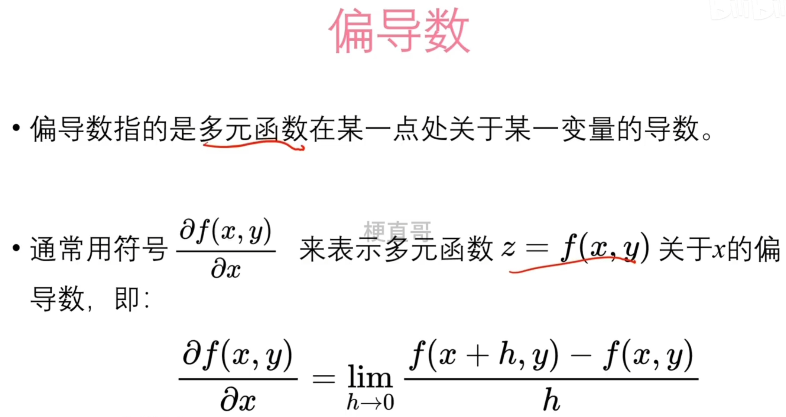
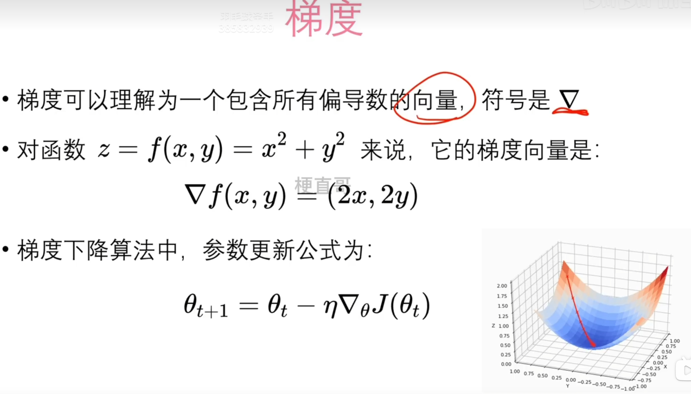
注意梯度是**包含所有偏导数的向量**，$\eta$ 是学习率，J表示损失函数

### 概率  
频率学派：试 $P_{n}(x)=\frac{n_x}{n}$   
古典学派：平均主义，未知事件发生的概率都是相等的 $P(x)=\frac{m}{n}$  
贝叶斯派：认为概率是不确定性，是个人的主观概念，表明我们对事物的相信程度。   


对于离散型的随机变量，期望是所有可能的取值与其概率pi相乘求和(当概率相同时等价于平均值)，对于连续型随机变量，期望是将所有可能的取值与其概率密度函数相乘(积分)  
价值函数是计算状态或者动作状态对的预期回报，这个预期回报是根据未来可能的奖励和转移概率计算得出的期望值，方差通常用于衡量价值函数的稳定性，因此降低价值函数的方差是一个优化目标。 
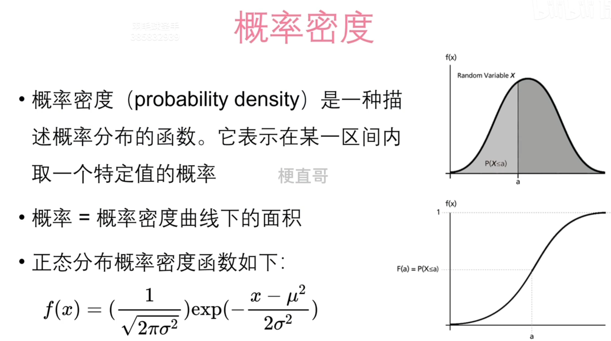 
假设有一个随机变量X服从正态分布，$\mu$是x的期望值，$\sigma$是x的方差，那么X在区间a到b内的概率就是f(x)在区间a到b内的积分(图一)。
对于连续随机变量，概率密度函数是其分布函数的导数，分布函数是描述某个随机变量小于等于某个值的概率的函数(图二)。  
因此，概率密度函数实际表示就是给定x的对应的概率值。  

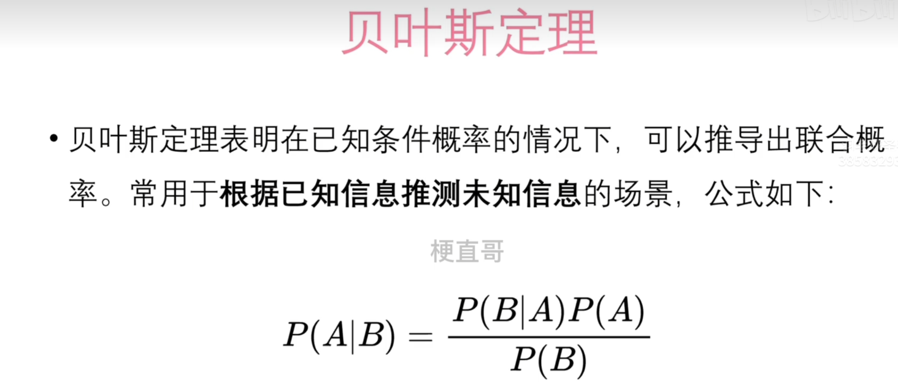

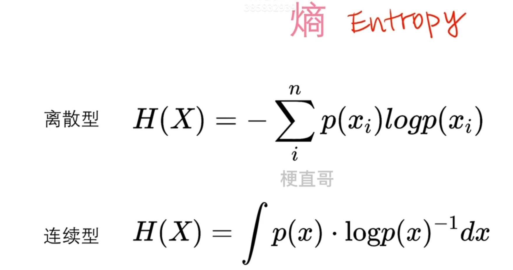
熵可以看作是一个随机变量的平均不确定性，对于离散型随机变量，可以通过将每个取值的概率与其对数相乘，并对所有可能性的取值求和来计算，对于连续型随机变量，可以通过将每个取值的概率密度函数与其对数相乘，对所有可能的取值进行积分来计算。  
强化学习中，熵被用来度量策略的多样性和探索性，策略是智能体在给定状态下选择具体动作的规则和方法。

交叉熵是用来衡量两个概率分布之间的差异性，一般用来衡量实际的输出和期望的输出之间的差异，特别是在分类任务中，交叉熵损失函数被广泛地用于训练神经网络；在强化学习当中，交叉熵损失函数被广泛应用于策略优化问题。  
相对熵，也叫kl散度，是衡量两个概率分布之间差异的另一种量度，它衡量的是一个概率分布相对于另外一个概率分布的信息增益或损失，在强化学习中，kl散度常常用于策略改进算法中，比如策略梯度算法中的重要性采样。  
### conda工具
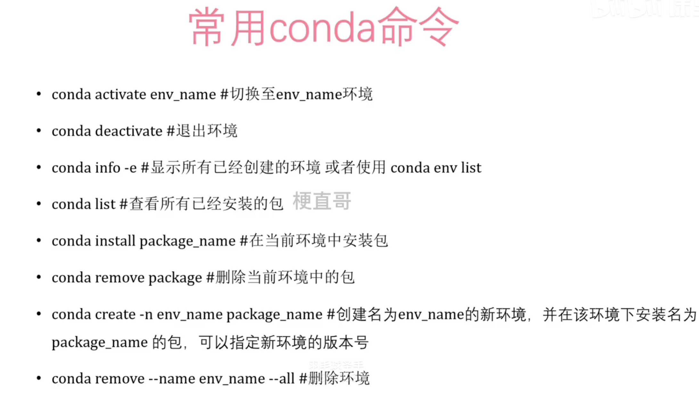
```
conda activate DeepLearning
conda install jupyter notebook
jupyter notebook
```

### Gym
开源环境仿真库，包含大量可用环境，目前最常用的强化学习环境库 
```
pip install gym=0.26.2
pip install pygame=2.3.0
```
```
import gym
# 创建CartPole环境，指定渲染模式为rgb_array, 如果是在IDE中可以改为‘human'
env = gym.make('CartPole-v1', render_mode='rgb_array')
# 重置环境
env.reset()

# 循环N次
for i in range(10):
    env.render() # 渲染环境
    action = env.action_space.sample() # 从动作空间中随机选取一个动作
    env.step(action) # 执行动作
# 关闭环境
env.close()
```
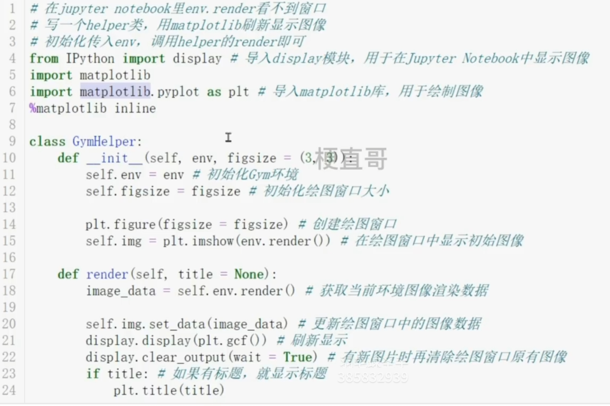

gym新库：gymnasium  
## 马尔可夫模型
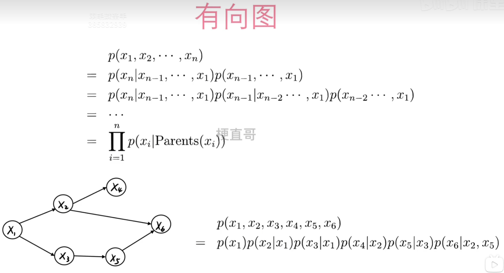
竖线后的节点都可以简化至只有父节点。
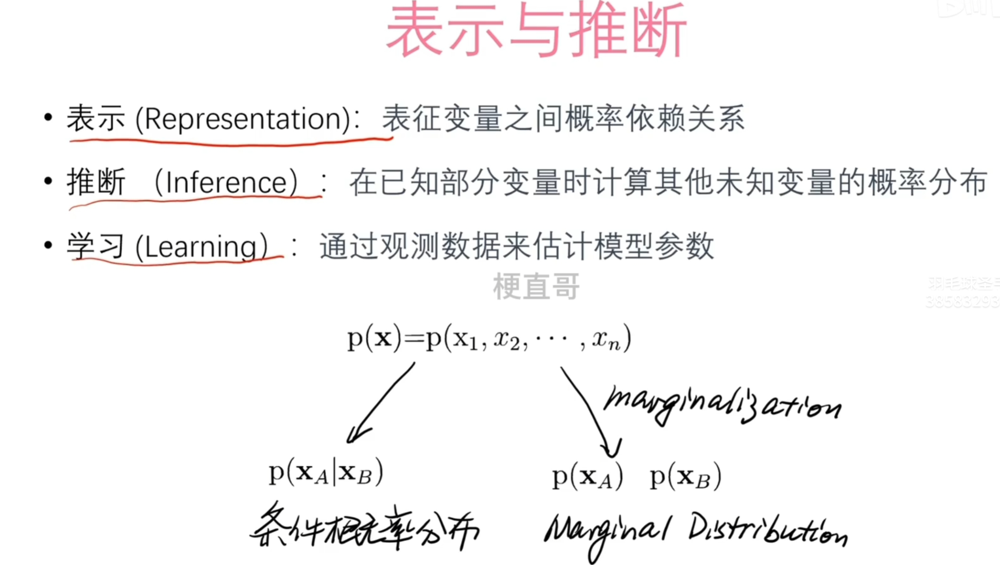

### 马尔科夫观测过程  

马尔科夫模型就是一个有向图，每个节点表示一个状态，每条有向边表示状态之间的转移，边上的权重表示对应转移的概率。
在马尔可夫模型中，假设状态之间的转移满足马尔可夫性质。


R表示实数集合，R^n表示n维实数集合  

离散情况下用状态转移矩阵，连续情况下用状态转移分布
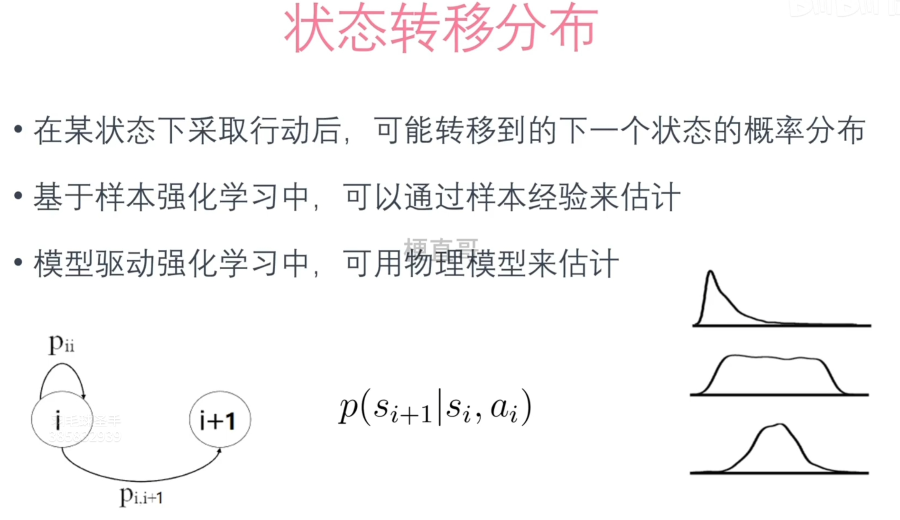 
可观测性：指该过程或模型状态是否能够被直接观测到或测量到。在机器学习中，通常会将数据看作是某个未知过程或者是模型的观测结果，希望从中推断出模型的内部的状态；强化学习中，可观测性是指智能体能否直接观测到环境的状态，如果可以，智能体就能根据观测的结果做出决策，比如在迷宫中寻找宝藏的游戏，智能体能够直接观测到当前所处的位置以及周围环境信息，这就是完全可观测的强化学习问题；如果环境状态不能被直接观测到，比如机器人的导航，智能体需要借助当前的观测的结果和先前的状态一起推断环境的状态并基于推断的结果做出决策，这就是部分可观测的马尔可夫过程，即隐马尔可夫模型。

因为状态未知，可以认为它们是隐藏的，又因为有先后顺序，所以可以用有方向的链来表示，节点与节点之间符合马尔可夫性质，这条隐藏的链条即马尔可夫链。

### 马尔可夫决策过程

$\pi$是策略，决策是过程，动作是结果；当状态是部分可观测时，对应的随机过程就是部分可观测马尔可夫决策过程(POMDP);比如在游戏等虚拟环境中，状态、动作以及它们之间的有向边的关系都是已知的、可观测的，一般直接用MDP进行建模；POMDP针对智能体无法直接观测到环境的状态，而是通过观测到一些信号来推断当前的状态的情况。  


随机性策略能更好的探索环境，让动作有更多的多样性。策略函数可以是一个简单的函数，也可以是一个复杂的机器学习模型，比如神经网络，$\pi(a|s)$表示在状态s下选择动作a的概率。
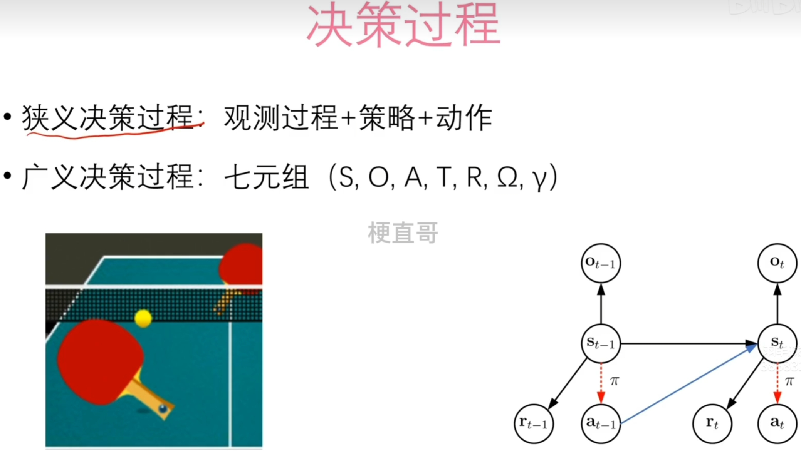
g广义决策过程：st取决于st-1和at-1  

### 马尔可夫奖励过程

奖励是环境给智能体的反馈；

模仿学习主要是学习策略函数，再反推奖励函数；逆强化学习是直接学习一个未知的奖励函数。


回报是一段时间内的累计奖励值，是一种未来的奖励值的合计，$\gamma$是衰减因子，用来说明更靠近现在时间步的权重更大一些；智能体需要通过选择合适的动作最大化未来的回报。  
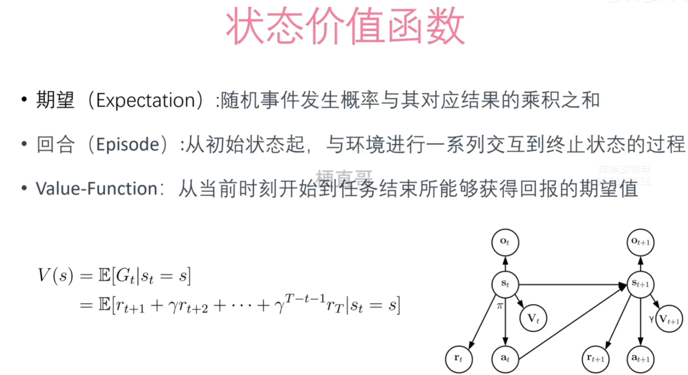
当前时刻的价值vt是由未来时刻的奖励决定的，它是动作at发出之后未来价值的一种估计，与rt没有关系，回报是单个episode的奖励的累计值，后者是多个episode的回报期望值，是为了更准确的估计某个策略的长期表现  
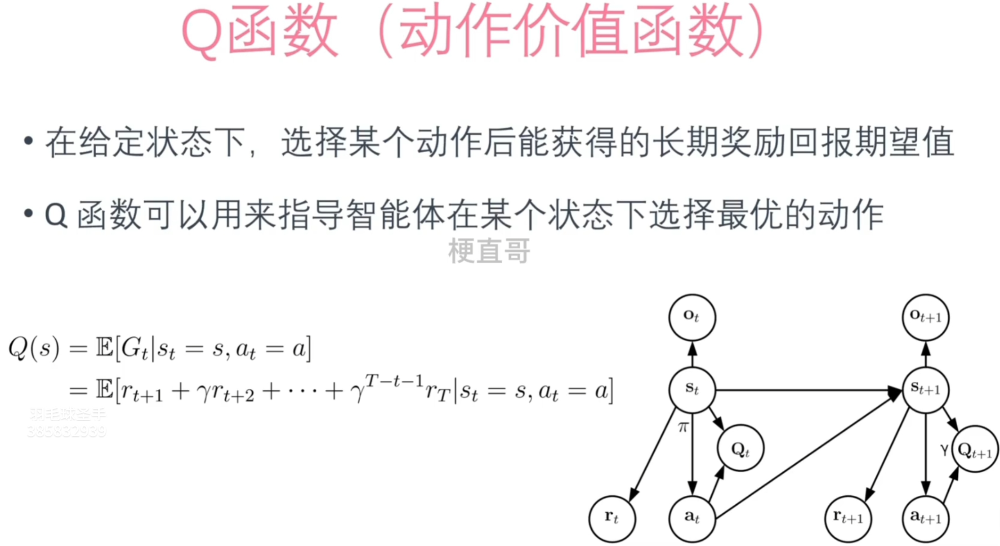
Q=quality，Q函数是对于动作的一种质量评估  
与状态价值函数的区别是奖励r同时由状态s和动作a决定。
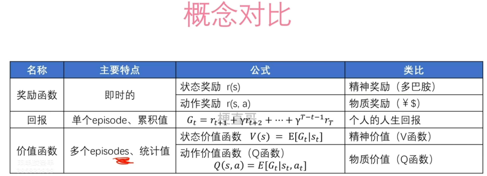
状态空间较小，动作空间相对较大时优选V函数；动作空间较小，状态空间较大时优选Q函数。  

### 贝尔曼方程  
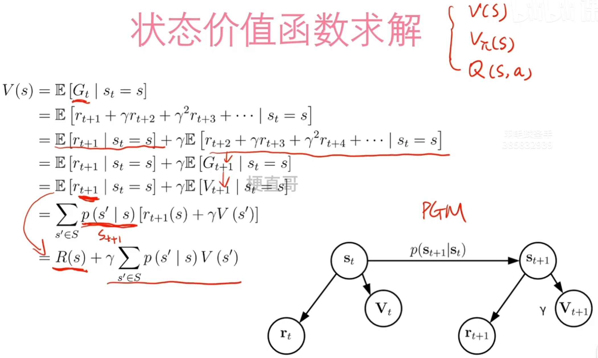
p()是状态转移概率函数，s'表示下一时刻的状态($s_{t+1}$)，R(s)表示的是$r_{t+1}$的期望值，即当前状态为s,下一状态为s'所得到的奖励值的期望值，后一项即是$V_{t+1}$的期望值。所以当前状态s下的价值函数值Vs可由下一状态的奖励函数的期望值和下一状态价值函数的期望值计算得到。  

$\pi(a|s)$表示在状态s下选择动作a的概率, p()是状态转移概率函数, R(s)表示的是$r_{t+1}$的期望值，即当前状态为s,采取动作为a,且下一状态为s'所得到的奖励值的期望值，后一项即是t+1时刻的策略价值函数的期望值。
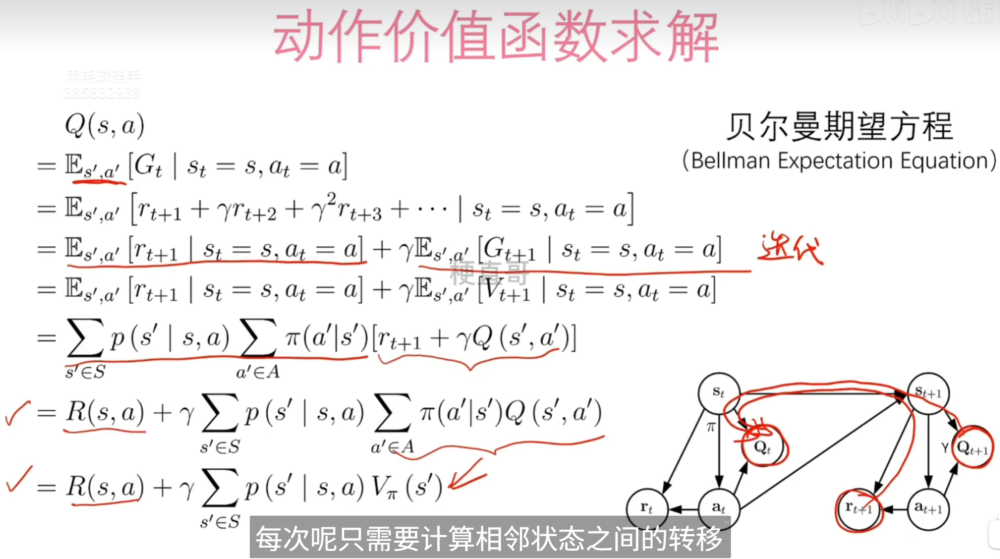


空心节点代表状态，实心节点表示状态动作对，在深度强化学习中，备份图的使用较少，因为深度强化学习中，主要使用深度神经网络来表示价值函数和策略函数，并通过梯度下降和梯度上升来更新。 

### 模型分类和选择
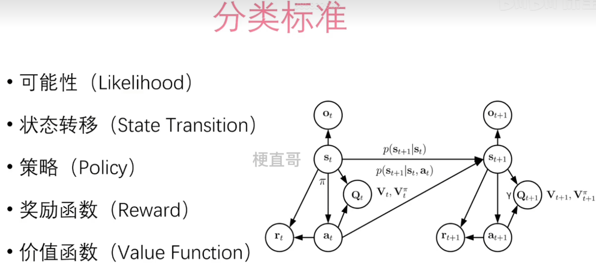
上图即广义马尔可夫决策过程，每条有向边都表示一个函数  


根据有没有状态转移函数来分类可以分为无模型算法和有模型算法；

智能体直接学习价值函数和策略函数，无模型算法往往需要大量的采样来估计状态动作以及奖励价值，进而优化策略，是一种数据驱动型的方法；对于无模型强化学习算法，一个典型的训练过程可能需要几十万甚至几百万帧的数据才能获得比较稳定的策略；但无模型的方法假设更少，泛化性更强。

基于策略和价值函数优先考虑哪一个，分为三类：  

基于价值类的方法中，并不是没有策略，只是不会显式的直接求它，而是直接求价值函数；动作空间简单，比如围棋象棋

对于大量真实世界中的任务场景，比如机器人控制、自动化假设等等，动作空间往往较大，而且是连续的，再用基于价值的方法就不行了，很难从价值函数直接推导得到动作，因此往往需要直接优化策略(策略梯度法，近端策略优化)。  
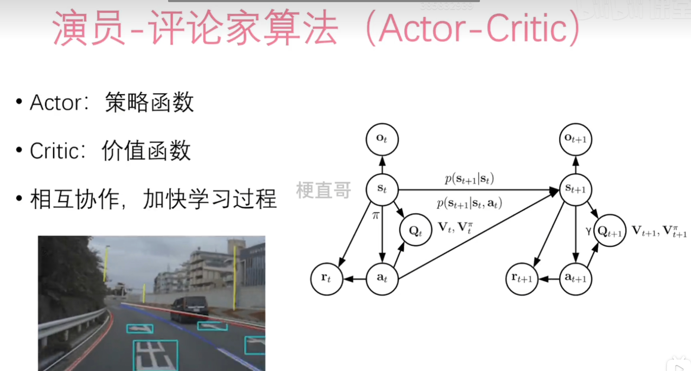
价值函数和策略函数同等重要，actor强调策略函数，critic关注价值函数的相互作用。  
模型选择方法：奥卡姆剃刀原则

马尔可夫随机过程代码实现：https://gitee.com/Gengzhige/Reinforcement-Learning/blob/master/Chapter-04/4.8%20%E9%A9%AC%E5%B0%94%E5%8F%AF%E5%A4%AB%E9%9A%8F%E6%9C%BA%E8%BF%87%E7%A8%8B%E4%BB%A3%E7%A0%81%E5%AE%9E%E7%8E%B0.ipynb   

## 动态规划方法
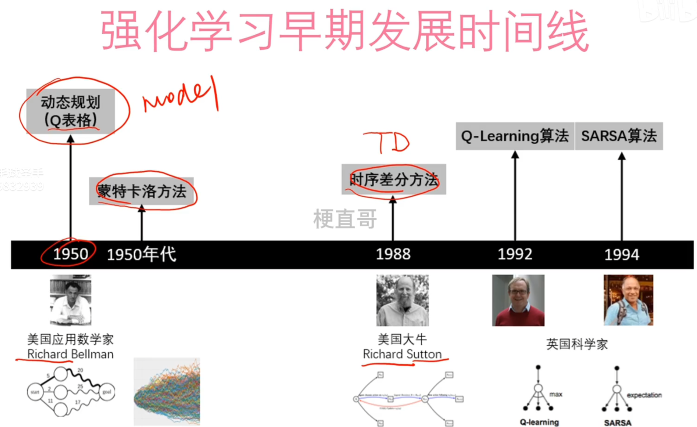
  

最优性原理：一个过程的最优策略具有这样的性质，无论其初始状态及初始决策如何，对于前面决策所造成的某一状态而言其后阶段的决策序列必须构成最优策略  
动态规划基本步骤：划分子问题；定义状态；构建状态转移方程；递归求解；存储中间结果。  

###  应用动态规划的思想解决强化学习问题
#### 注重策略-策略迭代

对于强化学习这样一个马尔可夫决策过程而言，在假定环境模型已知的情况下，即在pgm模型图当中，状态转移函数p是已知的，子问题分为两个，一个是求策略价值函数$V_\pi(s)$或动作价值函数Q(s, a),一个是求策略$\pi$,在策略迭代算法中，他们分别叫策略评估和策略改进；策略迭代就是反复进行策略评估和策略改进两个步骤来逐步实现策略$\pi$的优化；  
##### 算法步骤
首先是**初始化**，为整个马尔可夫决策过程定义初始化的策略，可以是随机策略或者确定性策略，它指定了在每个状态下应该采取的动作；  
接着进行**策略评估**，通过求解贝尔曼方程来计算价值函数V或者动作价值函数Q；  
然后进行**策略改进**，根据前一步计算得到的价值函数来更新策略，改善新能，具体来说，每个状态选择可以最大化价值函数的动作作为新的策略；  
最后，新的策略将再次用于价值评估，不断**迭代，重复评估和改进两个步骤**，直到价值函数收敛位置。  
算法最终为找到一个最优的策略，使得智能体可以获得最大的累计奖励。  
##### 策略评估
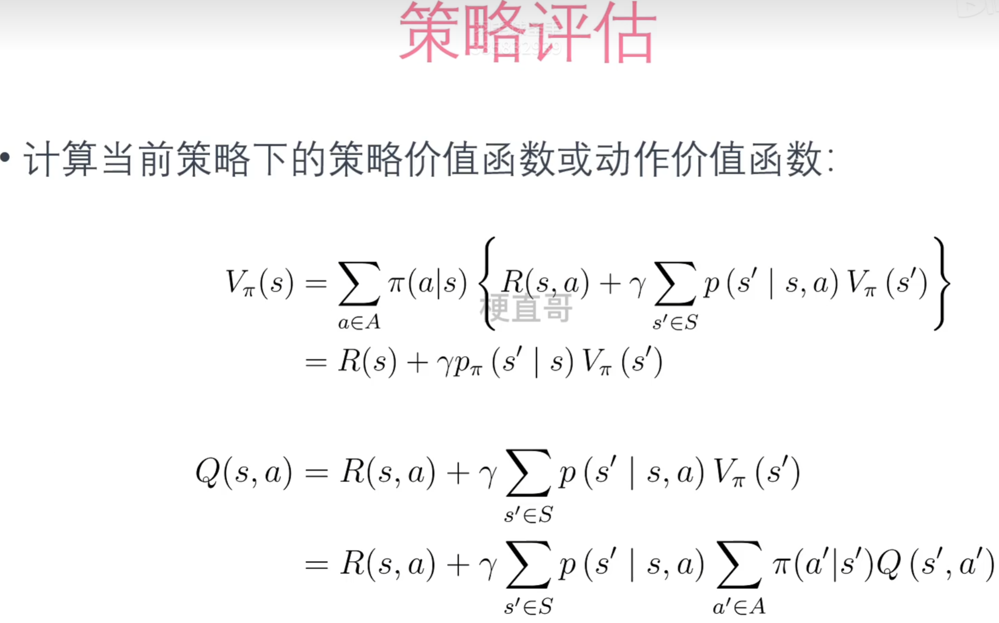
策略评估就是计算当前策略下的价值函数，可以是策略价值函数V,也可以是动作价值函数Q, $\pi(a|s)$就是在给定状态s的情况下采取动作a的概率，R(s,a)是即时奖励，p是状态转移概率，$V_{\pi}(s')$s是下一时刻的策略价值函数，S是状态空间所有状态的集合，a是动作空间所有动作的集合，**因为策略已经给定，所以前面的求和符号还有a的影响均可去掉。**  
举例：

假设智能体在一个4*4的网格中，每个网格代表一个状态，转移概率方面，通常假设智能体执行一个动作之后，状态转移到下一个状态的概率是确定的，例如如果在当前状态选择向上移动，那么转移到上方状态的概率为1，转移到其他状态的概率为0，此外在网格边界处，如果智能体执行向边界外的动作，它会保持在原地。折扣因子在0到1之间，重视长期奖励则选择接近1的因子；初始策略是在任何状态下都采取随机的动作，即上下左右都是0.25的概率，奖励值通常由人为设定，比如到达终点状态就+10，为了鼓励智能体尽快到达目标状态，可以对每个步骤施加一个负的奖励值，比如-1，如果网格中存在障碍物，可以对障碍物的碰撞施加较低的奖励值，比如-5。 
##### 策略改进

策略改进的本质就是取最大化操作(贪心操作), 如果更关注整体的状态价值，而不是每个动作的价值，此时可以使用状态价值函数的策略改进，如果需要关注每个状态下的具体动作价值，可以选择第二种动作价值函数的策略改进。这两种方法并不是互斥的，某些情况下这两种方法可以同时存在，结合求解。    
##### 策略改进最大化操作求解方法
Q表格：
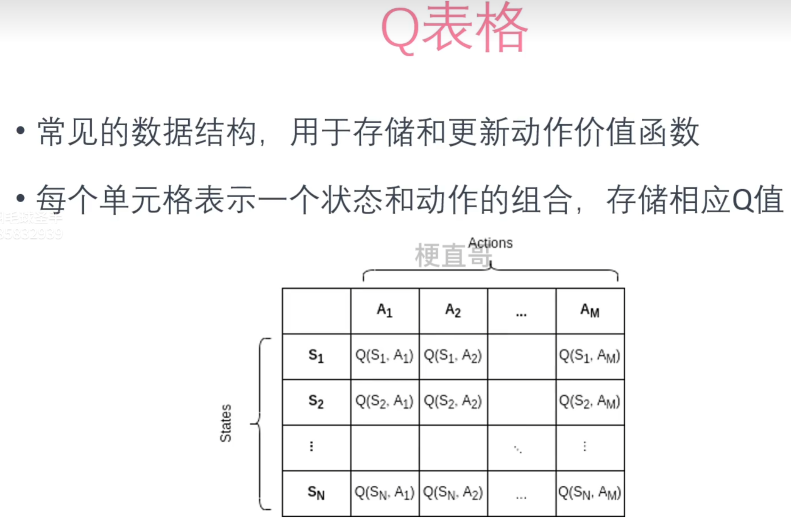
每个单元格表示在给定状态下采取特定动作的预期累计奖励；对于某个状态，选取每行中中的最大值，它对应的动作就是现在应该采取的最优动作，算法通过不算更新Q表格中的值来改善策略。如果任务的状态空间和动作空间比较大，那么Q表格的大小会迅速的增加，可能会导致存储和计算上的挑战，因此对于复杂问题一般会用函数逼近，比如神经网络来代替Q表格，近似Q值函数。  
贝尔曼最优方程：

贝尔曼最优方程即把最大化操作和贝尔曼方程结合，最佳策略下的状态价值等于这个状态下采取最好动作得到的动作价值。  
##### 策略迭代适用条件


#### 注重价值-价值迭代

根据动态规划的分解思想，可以把强化学习分解成两个子问题：价值估计和价值更新;策略迭代强调的是策略$\pi$, 即使求价值函数也是为了更新策略函数，而价值迭代以价值为中心，虽然每步迭代中也会有更新动作，但是是直接根据价值选择动作，没有去显式更新一个策略函数，即策略迭代中是显式的更新策略，价值迭代中是隐式的更新策略，也可以说在策略迭代中策略的更新是全局性的，而价值迭代中策略的更新是局部的。
##### 算法步骤
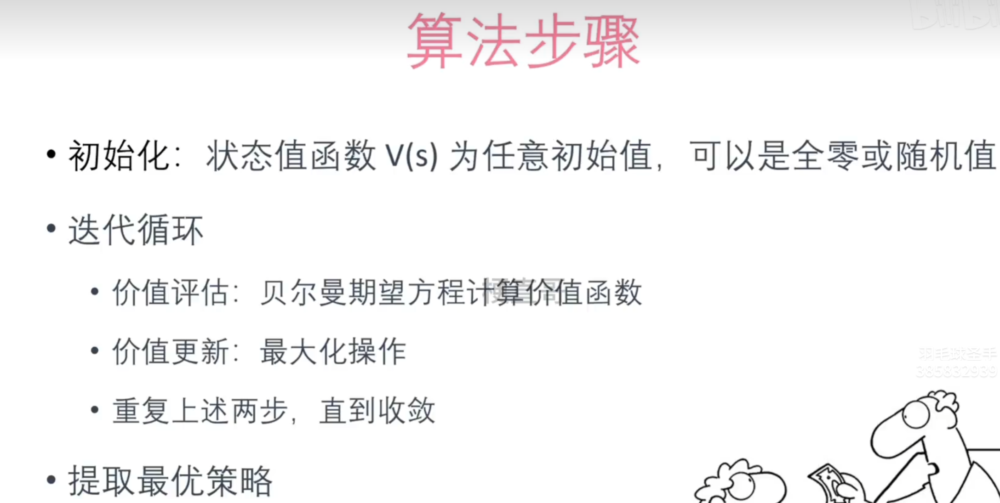
首先初始化状态价值函数为任意初始值，然后在每次迭代中，对每个状态s通过贝尔曼期望方程计算价值函数，然后通过最大化操作更新价值函数，重复迭代直至收敛。
##### 价值函数估计和更新
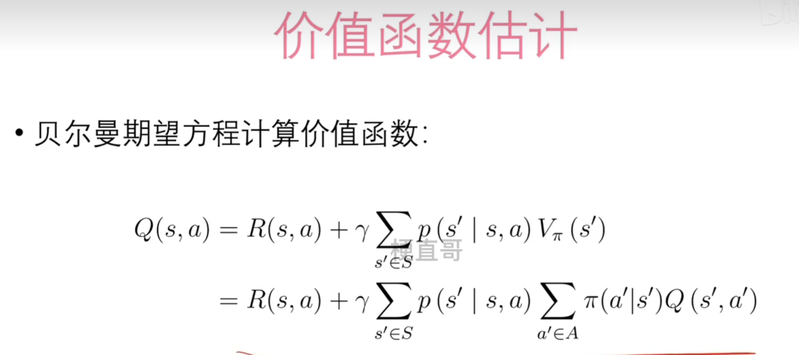
在价值迭代中，价值函数的计算策略评估的过程是相同的，都是使用贝尔曼期望方程来计算每个状态的价值函数

价值函数的更新就是直接找到Q函数的最大值，然后替换掉状态价值函数Vs,价值更新和策略更新主要的区别就是最大化操作符的不同，左边max返回的最大值本身，右边argmax返回的是使函数达到最大值的变量的取值(即动作)。  
###### 价值迭代适用条件
价值迭代计算效率高，但收敛速度较慢，尤其状态空间较大时；策略迭代更耗时，但能更快地收敛到最优策略。  

策略迭代是在每次迭代中先根据最优动作(或者动作概率)更新价值，在当前价值收敛后再根据最大价值选择每个状态的最优动作(或者更新动作概率)，价值迭代是每次迭代针对每个状态遍历所有可能的动作计算价值并选取最大的价值直接更新价值，直到所有状态的价值改变量小于阈值(收敛)，在收敛后再根据最大价值提取出每个状态的最优动作。  

## 经典无模型方法
### 蒙特卡洛方法
蒙特卡洛方法最初用于计算核物理实验中复杂粒子运动和相互作用问题，用来模拟和预测试验的结果，它的名字源自于摩纳哥的蒙特卡洛赌场，当时由于缺乏计算机技术，科学家们使用随机抽样和模拟方法来解决复杂的计算问题，一个科学家将这种随机抽样的方法比喻为在赌场进行赌博的过程，因此命名为蒙特卡洛方法。  
蒙特卡洛强化学习方法是一种基于样本估计的无环境模型，主要思想是通过与环境的交互，收集完整的轨迹数据，然后利用他们来估计状态价值函数或者动作价值函数；其本质是大数定理：独立同分布随机变量序列中，随样本数增加，均值会趋向于真实期望。换言之就是什么都不知道的时候，先瞎试瞎猜，即随机抽样，然后根据统计分析来估计，当数据量足够多的时候，就能得到问题的近似解。

假设环境未知，因此没有状态间的转移分布，智能体动作和环境的交互也是隐含的，是通过收集一个个episode(即从初始状态经过一系列交互到终止状态的过程序列)来隐含建模，不需要显式的定义或者规定具体交互方式，因此策略$\pi$也是隐含的，不需要直接估计或者测量这个函数，在蒙特卡洛方法中，**Q值被看作一系列的值，而不是一个函数，不再需要迭代计算，而是可以通过统计多个轨迹的奖励进行累计和平均后直接得到**，是一种基于经验采样的方法；需要注意的是，这个过程中奖励函数还是人为设定的，根据状态动作组合可以计算奖励的累计，即回报，进而可以计算每个时刻的价值。
### 算法步骤
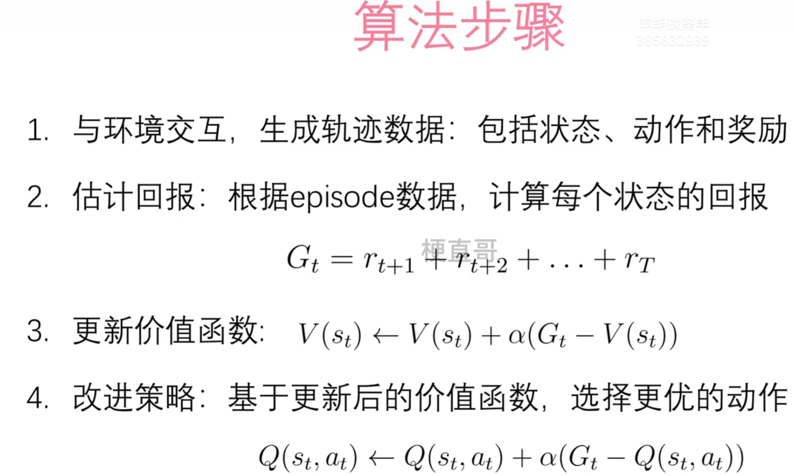
首先与环境交互生成并且收集轨迹的数据，包括状态动作和奖励，然后根据回合数据计算每个时间步的回报，这个回报可以是累计奖励的总和或者折扣；在更新价值函数时，其中$\alpha$是学习率，其迭代公式不是直接计算所有回报的平均值，而是一个一个回报的进行增量计算，因此也被称为增量蒙特卡洛方法，最后根据更新的价值函数选择更优动作。重复执行步骤2到4，收集更多的episode的数据并更新，直到收敛或者达到预定的停止条件。
### 适用条件


动态规划适用于问题规模较小且状态空间可以枚举时，蒙特卡洛方法通过采样episode的数据来估计价值函数，不依赖于贝尔曼方程，但是基于每个episode所得的完整轨迹经验进行更新，对于控制问题，可能需要更多的样本和计算资源，因此更适用于预测问题和交互式学习。  
蒙特卡洛方法是回合制的环境，每个交互周期可以看作是一个完整的回合，必须有明确的终点，在每个回合结束的时候可以获得完整的回合数据，包括状态、动作和奖励的序列。  

 
### 时序差分方法
基于价值的强化学习算法，侧重学习和优化价值函数 
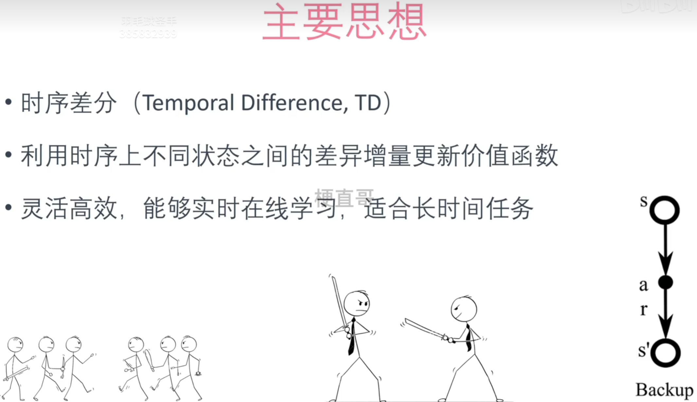
利用时间上不同的两个状态一前一后它们之间的差异来更新价值函数。 
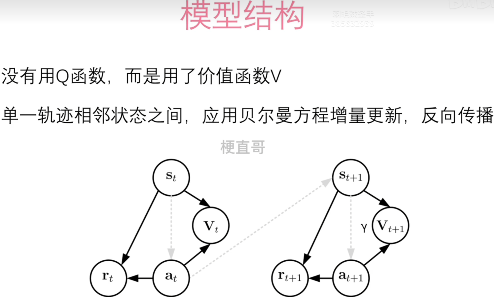
和蒙特卡洛方法相比，最大的区别是没有用Q函数，而是用了价值函数V, 它不使用多条轨迹，而是在单一轨迹的相邻两个状态之间利用增量更新进行价值函数的迭代，某种程度上就是价值的反向传播。这个过程中依然使用了贝尔曼方程，只是没有环境模型，也没有显式的估计策略，即没有P和$\pi$, 这点和蒙特卡洛方法是一致的，和动态规划方法是不同的。
#### 算法步骤

$\epsilon$-greedy: 贪心算法，以$\epsilon$的概率选择一个随机动作，以$1-\epsilon$的概率选择当前估计的最优动作，从而达到一定程度上的探索和利用的平衡。

$\gamma$是折扣因子，值越大表示越关注长期的回报，$\alpha$是学习率  
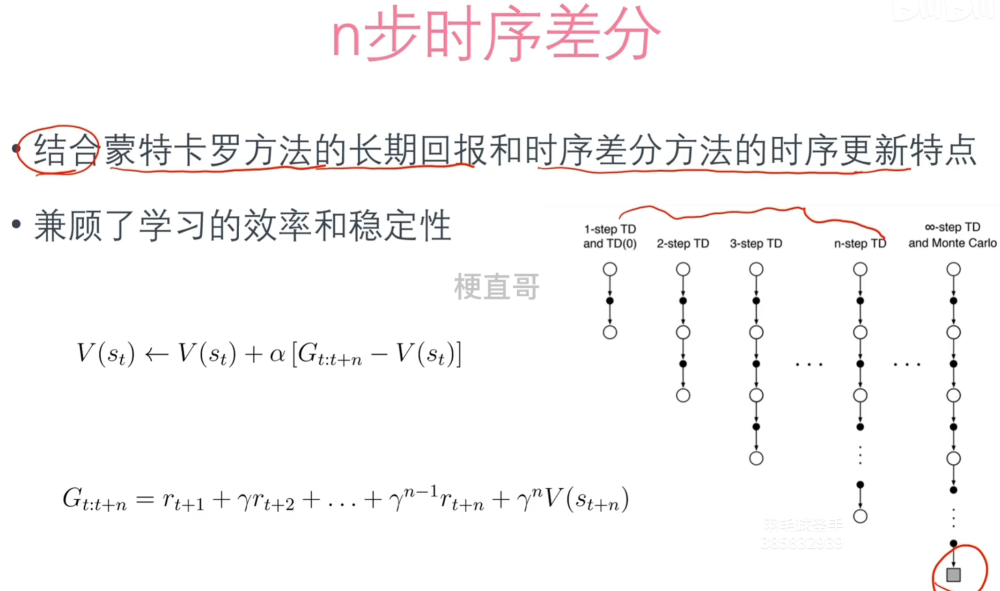
n步时序差分方法是将时序差分方法和蒙特卡洛方法结合起来使用，在更新价值函数时，不仅利用当前时刻的奖励和下一时刻的价值估计，还结合了未来多个时间步的奖励和价值估计。具体来说，在每个时间步上，先进行n步的探索，收集n步的奖励序列，并记录这段序列的起始和终止状态，然后根据未来n步的奖励和终止状态的价值估计更新起始状态的价值估计。  
#### 时序差分vs蒙特卡洛vs动态规划
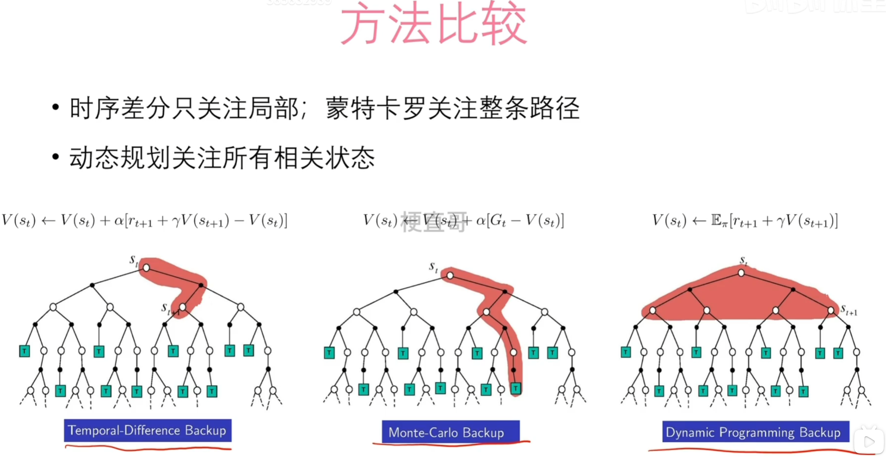
动态规划使用的是贝尔曼期望方程，蒙特卡洛和时序差分用的是贝尔曼方程，针对单个轨迹。

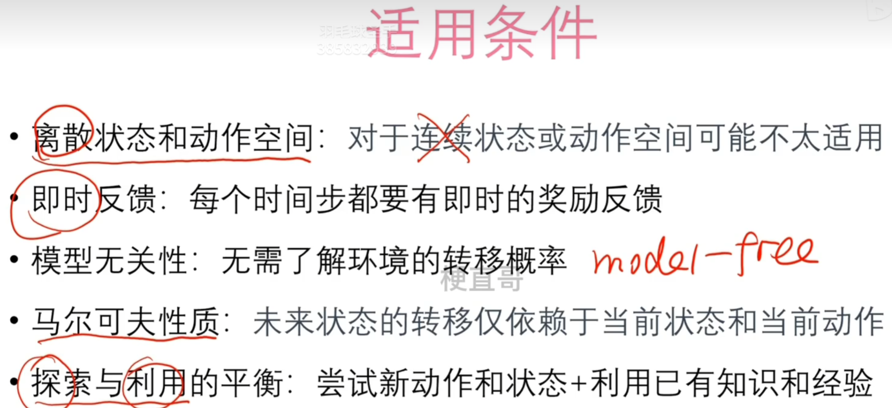
因为需要在每个时间步都更新状态、动作价值函数Q,因此不适用于连续的状态动作空间；时序差分方法假设强化学习问题满足马尔可夫性质，即当前的状态包含了过去的所有信息并且未来的状态的转移仅依赖于当前状态和当前动作，而蒙特卡洛方法没有此假设条件。
蒙特卡洛方法和时序差分方法代码实现：https://gitee.com/Gengzhige/Reinforcement-Learning/tree/master/Chapter-06  
### 广义策略迭代
本质上是无模型强化学习的一种框架，保留了策略迭代的思想，而非某种具体的算法。通过它的引入，我们可以将蒙特卡洛方法和时序差分方法统一到一个完整的框架下。主要思想：之前的策略迭代模型，第一步是策略评估，根据原始公式需要知道状态转移，而这在无模型环境下是无法求的，广义策略迭代就去掉了该公式，允许使用其他方法比如蒙特卡洛方法或者时序差分方法直接估计动作价值函数Q(s, a),在策略改进阶段可以仍然使用贪心算法，也可以使用其他优化算法，即广义策略迭代允许使用更高级的算法替换原有的策略评估方法，整个过程仍然保留了策略迭代两步计算的核心思想，但内核可以替换。  

N(S, A)表示在状态S下选择动作A的次数，用于控制探索与利用的平衡，选择次数选多更新权重越低。  
动态规划等有模型框架策略评估使用的是贝尔曼期望方程来求Q函数，需要状态转移函数和动作转移函数，无模型框架可以使用不需要显式状态转移函数的方法进行策略评估来求得Q函数，从而进行策略改进。  
### Q-Learning
通过构建和更新一个Q表格来学习最优策略，把所有的Q值归纳起来，构建了状态s、动作a和Q值之间的映射关系，用于策略的推导。不涉及任何复杂的概率推导，直接算数求表格。
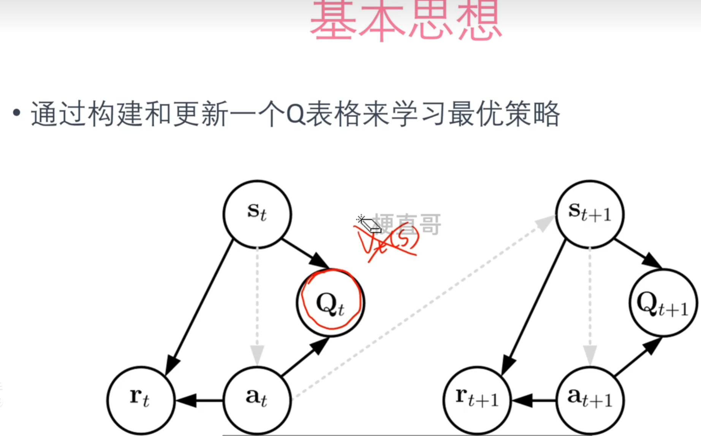
对比时序差分方法，Q-Learning做出的改变就是把更新状态价值函数的过程变成了更新Q函数,整个模型的架构依然没有状态转移，因此属于无模型的强化学习方法。  
从动作到下一时刻的状态以及从状态到动作的策略$\pi$都是未知的，没有直接估计策略的分布。
#### 更新思想
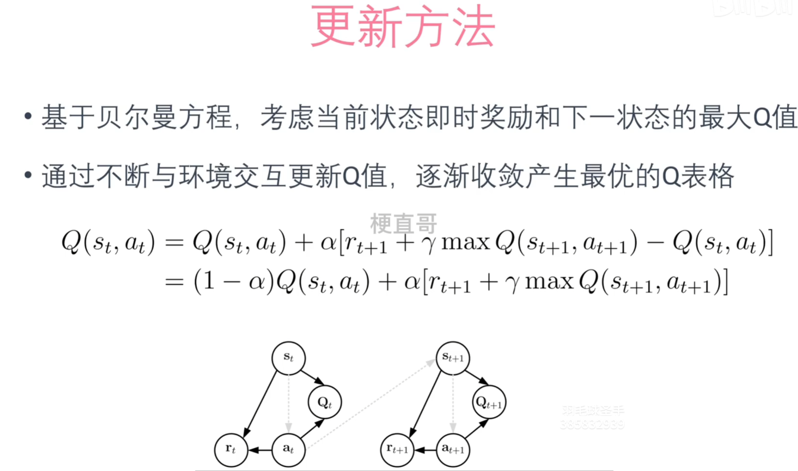
通过迭代逼近的思想来实现，初始时对所有Q值进行初始化假设,可以使用固定的初始值或者根据问题的具体情况定一个合理的初始值，然后每步根据状态St+1选取不同动作at+1得到的Q值，选最大的进行更新，随着学习的进行,Q值会逐渐更新和调整，逐渐收敛并接近其真实的值。在学习完成后，智能体可以根据表格中的值选择具有最高Q值的动作作为最优策略。
#### 异策略

几乎所有强化学习算法都可以抽象成两个阶段：收集数据和学习，前者就像是训练场，根据一个策略收集数据(动作选择上具有探索性)，然后提供给学习阶段更新策略；数据收集阶段的行为策略和学习阶段的目标策略函数不同，因此叫做异策略。行为策略和目标策略都是最大化Q函数，只不过前者是一个分情况的函数，使用$\epsilon$引入了更多的随机性，保证数据收集阶段能做更多的探索。如果学习阶段还这样的话就不容易收敛，因此不如直接最大化Q表格，学好的Q表格也可以再给到数据收集阶段用于新的迭代。这种数据收集与学习适度分离，允许两种策略的方法能够充分利用专家经验实验experience reply的效果，即在数据收集阶段，可以使用其他智能体或者是人类专家的策略，然后再学习阶段，再让智能体自己学习。
 
### SARSA算法  
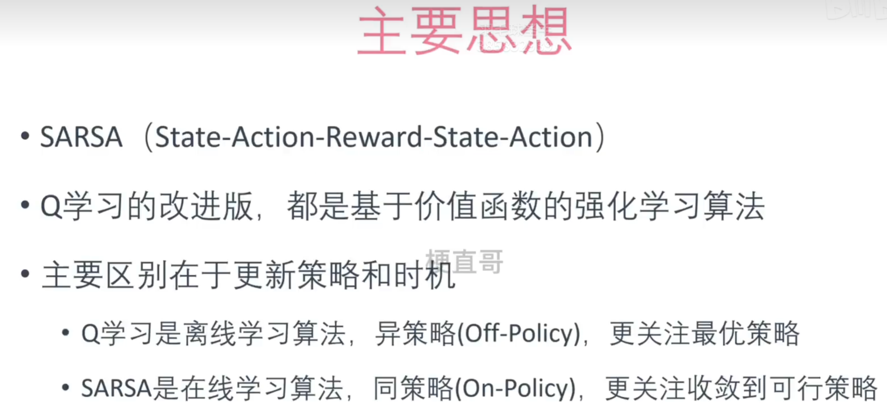
SARSA算法依旧使用Q表格来保存和更新Q值，进而学习策略，主要区别在于更新方式不同。
#### 更新思想
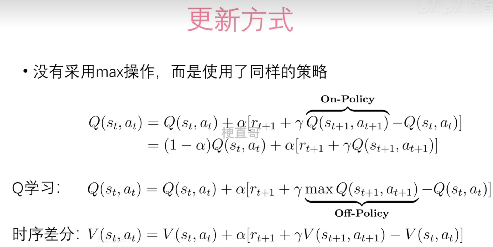
SARSA和Q-learning方法类似，唯一的区别是没有采用max操作，和时序差分方法的区别是更新的是Q函数，而不是V函数。
#### 同策略

同策略智能体用于选择动作的策略和用于更新价值函数的策略是相同的。

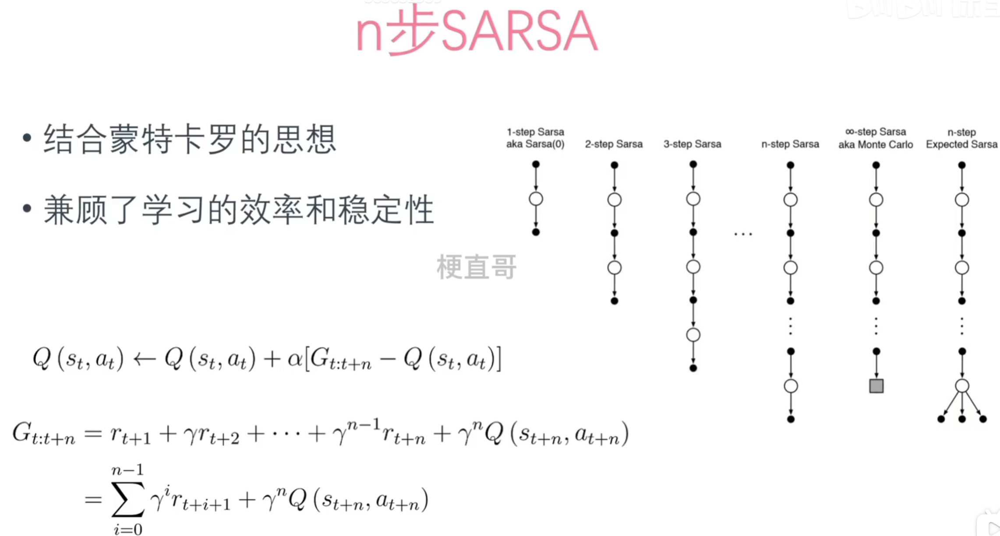
在n步而不是一步之后再更新Q和策略$\pi$, 相比于单步SARSA，n步SARSA可以通过一次更新同时考虑未来n步的奖励，因此收敛速度更快，较小的n值更注重即时奖励，更适合在动态环境下搜索，较大的n值更加注重长期回报。
#### 适用条件

必须是马尔可夫决策过程问题，其中状态转移满足马尔可夫性质，即下一个状态的转移只依赖于当前状态和当前采取的动作。
Qlearning和SARAS代码实现：https://gitee.com/Gengzhige/Reinforcement-Learning/blob/master/Chapter-06/6.7%20Q-Learning%20&%20SARSA%20%E4%BB%A3%E7%A0%81%E5%AE%9E%E7%8E%B0.ipynb  
主要就是q值更新方法不同  
### 深度Q网络： DQN  
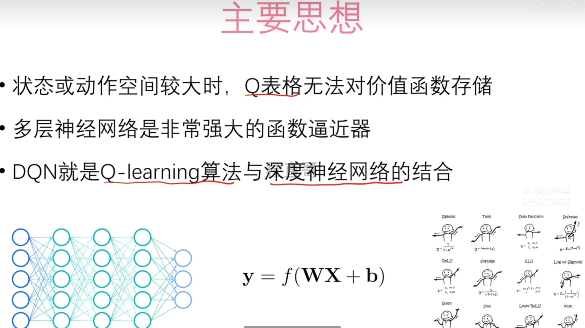
当状态空间或者是动作空间比较大，或者状态空间是连续的情况下，DQN的核心思想就是将强化学习中的Q_learning算法与深度神经网络相结合，用神经网络实现对高维状态空间价值函数的近似。
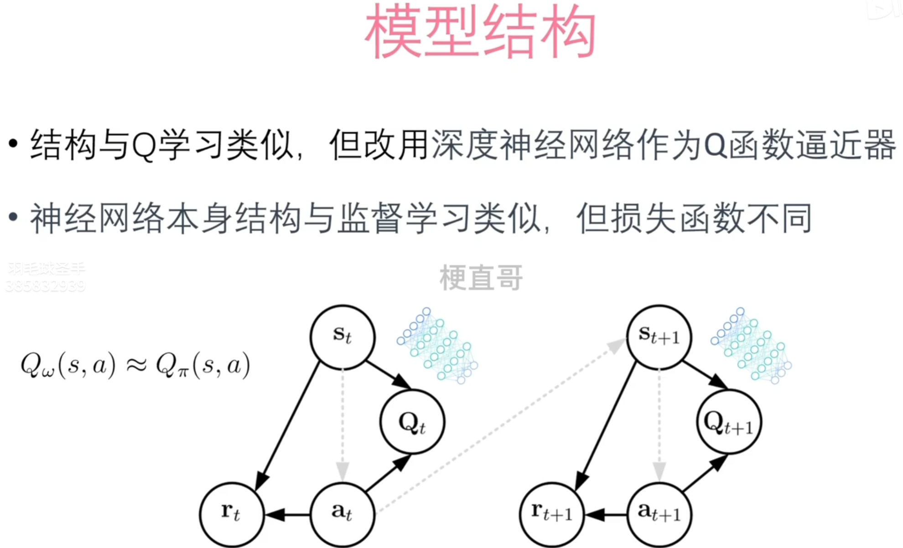
DQN在模型结构上和Q-learning算法几乎是一样的，是一个无模型的结构，没有明确的状态转移，根据Q函数通过如贪心策略直接选择动作。  
和传统Q-learning最大的区别就是价值函数的求解，改用神经网络作为动作价值函数的函数逼近器，将状态和动作的组合作为输入，输出相应的Q值作为估计，$\omega$是深度网络模型的参数。
#### 目标函数

DQN损失函数的计算$r_{t+1}$是基于单条轨迹上的即时奖励r，而不是多个轨迹的期望R。
#### 经验回放

每次的随机抽样可以提高样本的独立性，有效地保证训练的稳定性和效率。经验回放(使用用过了的数据)可以高效利用历史经验数据，提高数据的使用率，避免每次更新中只使用最新样本，极大地缓解了强化学习中小样本喂不饱神经网络的问题。  
其次连续样本往往时间上高度相关，可能导致训练过程中的偏差和不稳定，通过经验回放，DQN能够有效减少样本之间的相关性，使样本满足所谓的独立假设；第三有助于在探索和平衡之间寻找最佳的平衡。
#### 探索策略

#### 训练步骤
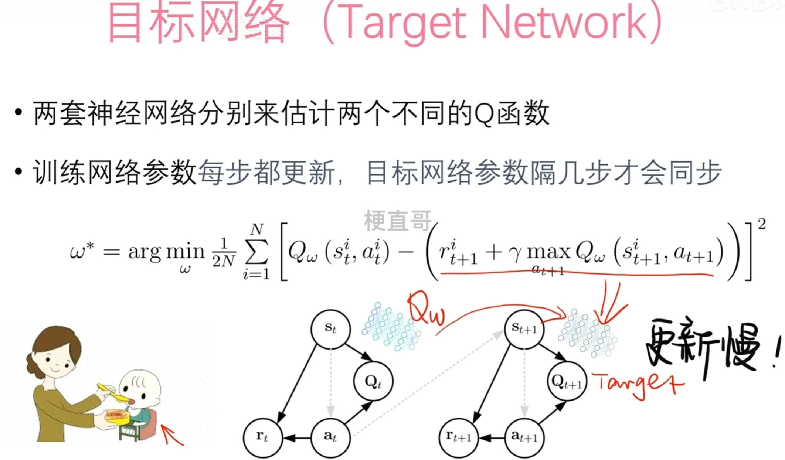
如果Qt和Qt+1都同频率在变动，那在更新网络参数的同时，目标也在不断地改变，这非常容易造成神经网络训练的不稳定性。为了解决这个问题，DQN提出了目标网络的思想。
具体来说，就是用两套神经网络分别估计两个不同的Q函数，目标网络的参数自己不会更新，只是隔几步才会把训练网络的参数同步一下。  
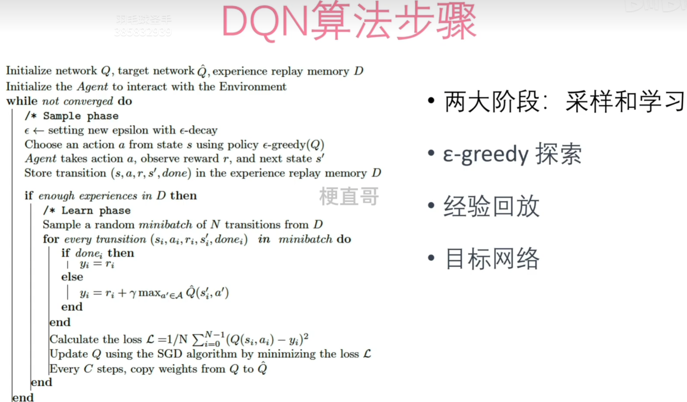
开始初始化两个网络和经验池，然后进入while循环，分为采样阶段和学习阶段，采样阶段先调整并设置一个较大的$\epsilon$,然后在训练过程中逐步减小，接着智能体采取行动，观测奖励以及下一时刻状态并存入经验池；  
当经验池有足够数据后，进入学习阶段，先从经验池选择一小批数据元祖，然后循环遍历所有的数据元祖，计算损失函数并利用随机梯度下降法来更新训练网络Q，每隔C步同步权重给目标网络函数。
每步迭代都是先随机采样形成训练样本然后再训练网络。
#### 适用条件

DQN代码实现：https://gitee.com/Gengzhige/Reinforcement-Learning/blob/master/Chapter-07/7.2%20DQN%E4%BB%A3%E7%A0%81%E5%AE%9E%E7%8E%B0.ipynb  
#### DQN的常见改进  
**双深度Q网络DDQN**：经典DQN有个显著的问题，估计的Q值往往会偏大，因为它是以下一时刻的状态的Q值的最大值来估算的，
但是下一个状态的Q值也是一个估算值，也依赖它的下一个状态的Q值最大值，一直这样误差传递，导致了Q值往往偏大。 
 
核心思想：用两个参数不同的Q网络，独立更新，先根据$S_{t+1}$和左边的Q网络来选择最大的动作，使用argmax操作，
然后把找到的最大动作和$S_{t+1}$传给右边的$Q_{t+1}$网络用于更新，
即目标网络的更新方式变了，不是根据自己时刻的动作$a_{t+1}$,而是根据Q网络选的最大动作来更新。  
动作a（$a_{t+1}$）的选择由目标网络换成由Q网络来选择，目标网络根据Q网络选定的动作计算$Q_{t+1}$的值  
实现：同时用模型网络和目标网络计算$S_{t+1}$的Q值，根据模型网络计算的Q值选出最大化的动作a,然后取目标网络在$S_{t+1}$下计算的状态a的Q值  
**Dueling DQN**: 在传统DQN中，每个动作价值Q(s, a)都需要计算，然而在某些情况下，评估状态价值并不需要每个动作的细节，因此会浪费计算存储开销。

可以把状态值Vs当做不同动作的公共部分，视为基准值，而优势函数A可以视为一种增量值，即在给定状态下动作a相对于其他可选动作在价值上的差异；
好处在于处理大型动作空间的问题时，只需要对每个动作的优势函数进行计算，而基础部分的状态值Vs是共享的。
**Noisy DQN:**

与传统$\epsilon$-greedy算法相比，增加了探索能力，其次避免了过早陷入固定行为模式，传统的贪心策略可能导致智能体陷入某种固定的行为，过度依赖已知的左右动作。  
**优先级经验回放：**

原始的经验回放是均匀采样，没有考虑到不同样本之间的重要性差异；优先级经验回放赋予学习效率高的以更大的采样权重。
目标函数中TD error越大，说明该状态价值函数Q与TD的目标差距越大，agent的更新量越大，因此该处的学习效率就越高，因此可以用TD error来做权重。
改进方法代码实现：https://gitee.com/Gengzhige/Reinforcement-Learning/blob/master/Chapter-07/7.4%20DQN%E5%B8%B8%E8%A7%81%E6%94%B9%E8%BF%9B%E5%92%8C%E6%89%A9%E5%B1%95%E4%BB%A3%E7%A0%81%E5%AE%9E%E7%8E%B0.ipynb

### 基于策略的强化学习算法
早期的算法主要集中在价值方法上，首先求解状态价值函数V或者动作价值函数Q, 然后使用贪心算法argmax来选择动作，这类方法在状态空间和动作空间较小而且离散的情况下效果还不错；
然而当状态空间变得较大而且动作空间是连续的时候，传统的基于价值的方法就不那么适用了。  

基于策略的算法对策略函数直接优化，而不是间接地优化价值函数，它直接建模和优化策略，因此可以更好地适应连续动作空间和高维状态空间，基于价值函数的算法借助价值函数指定策略的时候需要比较各种动作的价值大小，如果动作空间维度较高或者是连续的时候从中比较得出有最大价值的动作比较困难。  
在策略梯度中，参数化的策略$\pi$不再是一个概率集合，而是一个概率密度函数，$\theta$是它的参数，策略梯度的核心思想就是通过设计一个基于策略的目标函数对其使用梯度上升优化算法来最大化奖励。
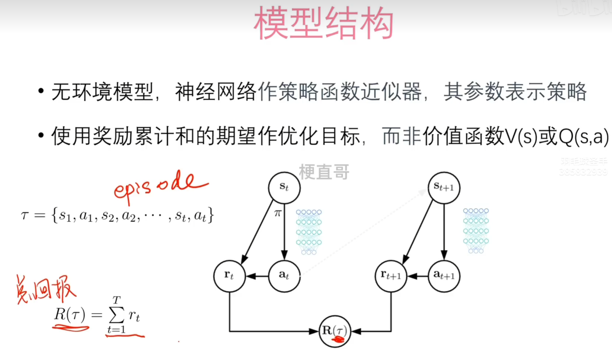
用神经网络作为策略函数的函数逼近器，使用策略梯度进行更新，通过优化它的参数来优化策略$\pi$
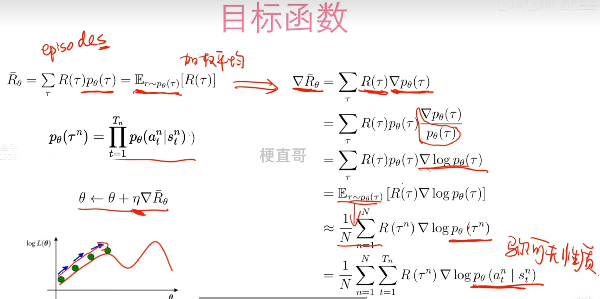
目标是在N个episode中找到最佳策略，即所有的回合的总回报的平均值最大，这个平均值是加权平均，因为每条轨迹发生的概率不同。$\theta$是模型参数。  
#### 策略梯度的两种改进
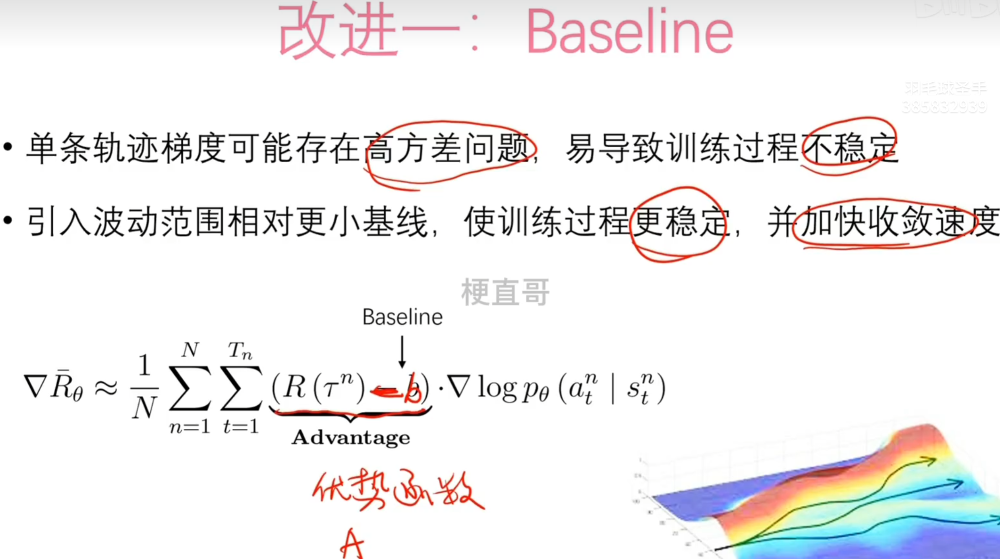
减小方差并加速策略优化的收敛速度。  
策略梯度的计算通常使用采样轨迹的方法，通过多条轨迹，即多次与环境的交互来收集数据，每条轨迹都会算出一个梯度来更新策略函数的参数，然而单个轨迹的梯度可能存在高方差的问题，容易导致训练过程的不稳定；
为了解决这个问题，引入一个基线，即对回合回报减去一个b,具体可以减去总奖励均值再除以方差来实现，这样可以将奖励调整为均值为0，方差为1的分布，从而使得梯度更新的尺度更加合适。  
某种程度上可以将优势函数视为价值函数在策略梯度算法中的一种变体，属于价值评估的范畴。

原始目标函数中，同一个episode里所有时间步的状态动作对使用同样的奖励来进行加权，这是不合理的；
修改方法：在计算某个时刻的奖励的时候，不使用整个episode的奖励，而是计算从当前这个时刻执行以后的累计奖励，因为在这之前发生的事情和这个动作是没有关系的；
并且在累计奖励时可以再乘以一个系数，把未来的奖励做个折扣，因为一般情况下，时间越久当前动作的影响力就越小，因此系数随时间指数级减小。
#### 算法步骤

VPG算法是最基本的策略梯度算法；
根据误差平方和调整基线值，使其更加接近实际回报的估计值？  
这里是在多个episode上一起通过计算平均值来更新策略梯度的？  
注意更新完模型后要重新采样数据再更新模型，即采样的数据只会使用一次
#### 适用条件

### 蒙特卡洛策略梯度

核心思想是通过采样轨迹来估计策略的梯度，并且使用梯度上升法来更新策略参数，最大化累计的奖励。
和经典的策略梯度相比，主要的不同是更新方式，vanilla方法是采用多条轨迹计算平均值，然后一次性更新策略梯度。而蒙特卡洛策略梯度则是逐条轨迹对策略参数进行更新。
严格意义上蒙特卡洛策略梯度也是一类方法，最典型的一种是reinforce算法。

模型结构和经典策略梯度算法相似，策略函数用神经网络函数来逼近，唯一的区别是价值函数的表达形式，这里选用了回报Gt而不是轨迹的总回报，这和改进型vanilla算法相比相差不大，两种方式的主要区别在神经网络的更新方式上。
vanilla算法是多条轨迹一起更新策略，比如5个episode只更新一次，而蒙特卡洛策略梯度是一条轨迹更新一次。


但看目标函数，蒙特卡洛策略梯度目标函数和改进二的策略梯度目标函数是相似的，目标函数J是给定策略后的累计奖励期望，更新是以单条轨迹为单位进行，并没有求N条轨迹的总和。
最后一步把它表示成了前后时刻回报迭代的形式，便于计算。
#### 算法步骤
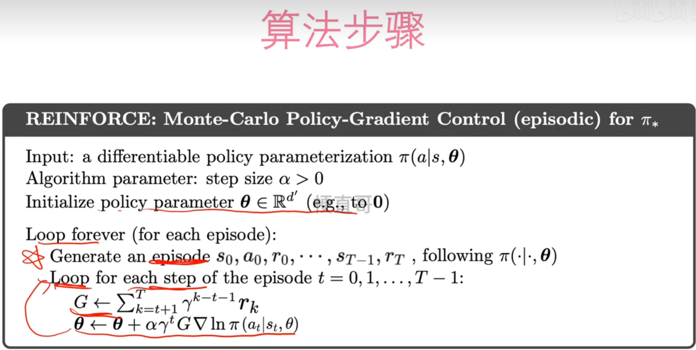
首先初始化策略参数，然后开始轨迹循环，根据当前策略生成一条轨迹，接着进入第二个循环，遍历轨迹内部的各个时间步，先计算回报G, 接着根据梯度上升更新参数。
虽然最后一步中策略参数被更新了，但是这个新的策略并没有立即用于生成新的episode。而是等遍历完整个episode之后再更新策略。
代码实现：https://gitee.com/Gengzhige/Reinforcement-Learning/blob/master/Chapter-08/8.3%20%E7%AD%96%E7%95%A5%E6%A2%AF%E5%BA%A6%E6%96%B9%E6%B3%95%E4%BB%A3%E7%A0%81%E5%AE%9E%E7%8E%B0.ipynb  
缺点：一个episode只能更新一次参数   
### 近端策略优化算法PPO
openai公司在2017年提出来的，chatgpt训练使用

将数据采样和训练学习分离，两个阶段所使用的policy不一定相同。  
#### 重要性采样

csdn参考：https://blog.csdn.net/qq_57565004/article/details/152051599?utm_medium=distribute.pc_relevant.none-task-blog-2~default~baidujs_baidulandingword~default-0-152051599-blog-146460916.235^v43^pc_blog_bottom_relevance_base9&spm=1001.2101.3001.4242.1&utm_relevant_index=3  
(很妙) ppo讲解： https://www.bilibili.com/video/BV1iz421h7gb?buvid=XU11FF212E704E69F1794654F65F97F8F3FF4&from_spmid=search.search-result.0.0&is_story_h5=false&mid=hvOBq1yDUHiSQtqD747iRQ%3D%3D&plat_id=116&share_from=ugc&share_medium=android&share_plat=android&share_session_id=600a2d9b-28d4-4ec8-9576-19c763c9e523&share_source=WEIXIN&share_tag=s_i&spmid=united.player-video-detail.0.0&timestamp=1761834190&unique_k=972W2mP&up_id=18235884
待分解...  
#### 目标函数
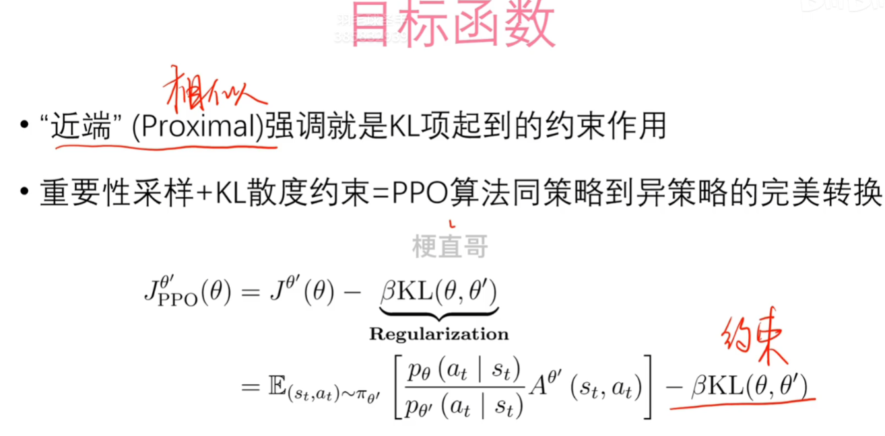
重要性采样实现的是两个策略分布的转换，同时用两个样本的比值来调整误差，KL散度用来约束两个分布的差异性

目标函数的1/N求样本平均可以简化掉，直接求和即可，原因一：假定所有样本的概率相同；原因二：求梯度的情况下除以样本数N作用不大

核心逻辑是A>0时目标策略分布不能过于大于采样的策略分布，A<0时目标策略分布不能过于小于采用的策略分布 
#### 算法步骤 
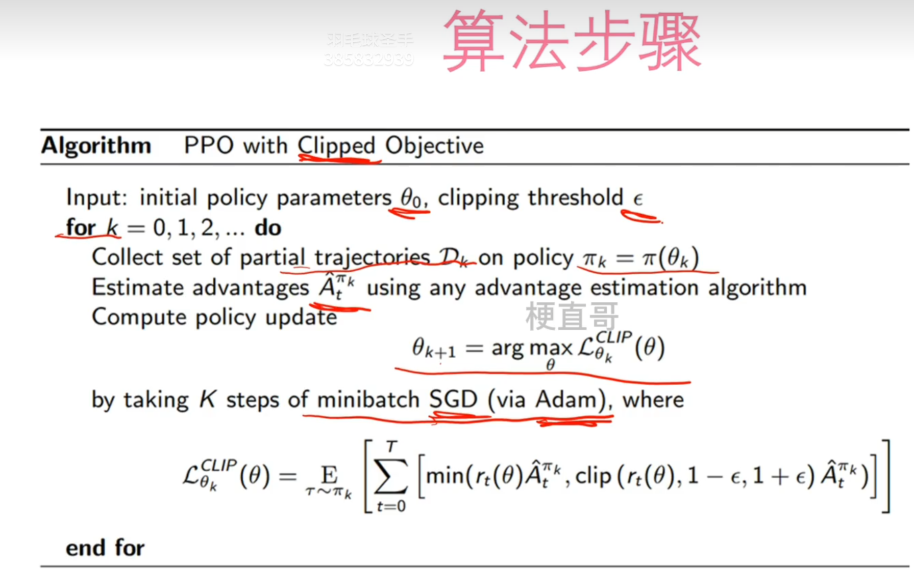
PPO代码实现：https://gitee.com/Gengzhige/Reinforcement-Learning/blob/master/Chapter-08/8.5%20PPO%E4%BB%A3%E7%A0%81%E5%AE%9E%E7%8E%B0.ipynb  
仅包含一个策略网络和一个价值网络，重点是策略网络的随时函数。
### 演员评论家算法 
当状态空间和动作空间比较小或者说是离散的时候，价值类算法比较有优势，简单高效；当状态和动作空间比较大或者连续的时候，直接更新策略梯度的方法比较有效。  
演员评论家算法使用了策略梯度和时序差分，是二者的有机结合。 
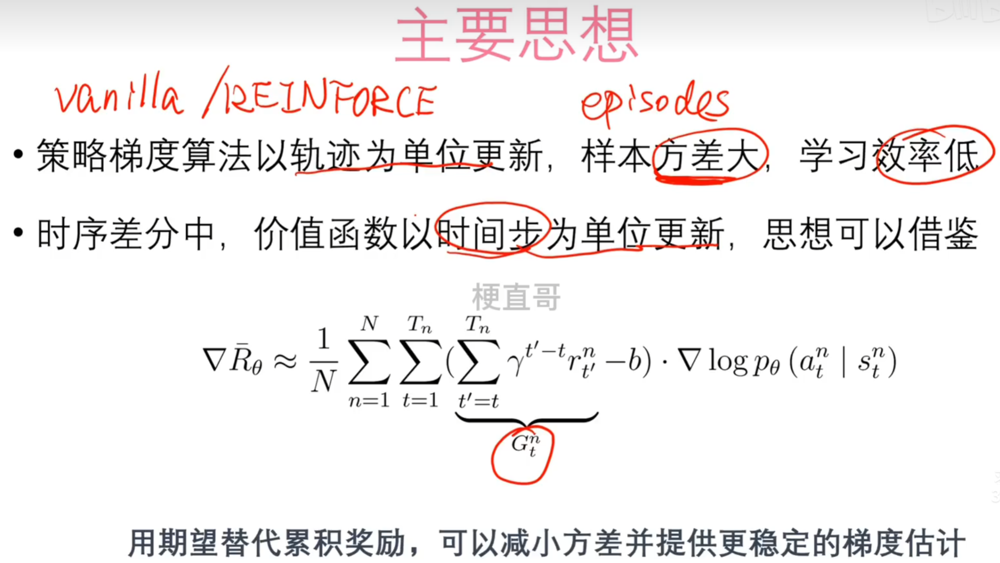
#### 目标函数

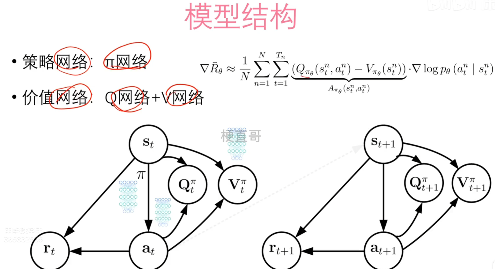
策略被称为演员，价值函数是评论家。  
在 REINFORCE 算法中，每次需要根据一个策略采集一条完整的轨迹，并计算这条轨迹上的回报。这种采样方式的方差比较大，学习效率也比较低。我们可以借鉴时序差分学习的思想，使用动态规划方法来提高采样的效率，即从状态 s 开始的总回报可以通过当前动作的即时奖励 r(s,a,s’) 和下一个状态 s′ 的值函数来近似估计，即用Q(s, a)来估计。
#### A2C改进
 
把这个期望值估计函数Q换成r+v的好处就是不需要估计 Q 了，只需要估计 V 就够了。但这样就引入了一个 r ，它是一个随机变量。但是这个随机变量，相较于累积奖励 G 可能还好，因为它是某一个步骤会得到的奖励，而 G 是所有未来会得到的奖励的总和。G 的方差比较大，r 虽然也有一些方差，但它的方差会比 G 要小。所以把原来方差比较大的 G 换成方差比较小的 r 也是合理的。  
#### A3C改进

A3C算法是一个分布式的体系结构，通过异步更新和参数共享的方式实现高效训练。 
A3C一开始会有一个 global network。它们有包含 policy 的部分和 value 的部分，假设它的参数就是$\theta1$，​对于每一个 worker 都用一张 CPU 训练（举例子说明），第一个 worker 就把 global network 的参数 copy 过来，每一个 worker 工作前都会global network 的参数 copy 过来。  
然后这个worker就要去跟environment进行交互，每一个 actor 去跟environment做互动后，就会计算出 gradient并且更新global network的参数。这里要注意的是，所有的 actor 都是平行跑的、之间没有交叉。所以每个worker都是在global network“要”了一个参数以后，做完就把参数传回去。  
所以当第一个 worker 做完想要把参数传回去的时候，本来它要的参数是θ1​，等它要把 gradient 传回去的时候。可能别人已经把原来的参数覆盖掉，变成θ2了。但是没有关系，它一样会把这个 gradient 覆盖过去。  
演员评论家算法原理：https://blog.csdn.net/weixin_42301220/article/details/123311478  
### 深度确定性策略梯度DDPG 
演员评论家算法在离散动作空间中应用较多，而且原始设计都是在线的策略优化算法，在线策略意味着智能体在与环境交互的同时进行网络参数的更新。  
DDPG一是着重解决了连续动作空间的问题，二是可以进行离线的异策略优化。  
#### 离散动作与连续动作

离散动作的控制方式通常用整数或者离散的编码来表示；连续动作可以用实数或者向量来表示，智能体可以直接输出连续动作的值。
对于连续的动作控制空间，Q-learning与DQN等算法是无法处理的。我们无法用这些算法穷举出所有action的Q值，更无法取其中最大的Q值。那如何输出连续的动作呢，我们可以借用万能的神经网络来处理。在离散动作的场景下，比如输出上下左右这四个动作。有几个动作，神经网络就输出几个概率值，我们用πθ(at∣st)来表示这个随机性的策略。在连续的动作场景下，比如要输出机器人手臂弯曲的角度，这样的一个动作，网络就输出一个具体的浮点数，用μθ(st)来代表这个确定性的策略。  
#### 随机性策略与确定性策略
对随机性策略来讲，输入某一个状态s，采取某一个动作的可能性是一个概率值，类似抽奖，根据概率随机抽取某一个动作。而对于确定性策略来讲，它没有概率的影响。当神经网络的参数固定下来了之后，输入同样的状态，必然输出同样的动作，这就是确定性的策略。

在策略网络的实现上，输入都是状态s，但是网络的最后一层分别选用了softmax函数和tanh函数，对于离散动作空间，输出是个分布，通过采样得到最后的动作选项；对于连续的动作空间，输出是一个确定的标量值，直接就是动作的描述。 
####  DDPG模型结构

DQN中是隐式策略，并没有直接求策略的分布，而是通过取价值函数最大值来获取动作a; DDPG直接用神经网络逼近策略函数分布。原先的随机策略变成了确定性策略，给定一个状态s,就会对应一个唯一的动作a。
DDPG主要有两点：1、使用了确定的策略；2、使用了双网络，DDPG有Critic当前网络，Critic目标网络，Actor当前网络，Actor目标网络。  
对连续空间使用确定性策略的好处：原理上并不是连续空间就不能用随机策略，主要是基于计算效率的考量，对于随机的情况，策略梯度计算时需要对状态和动作同时做积分，非常复杂，而确定性策略只需要对状态进行积分。  
在高维动作空间时，确定性策略比随机策略更容易训练。但是确定性策略的缺点是动作选择完全对应一个状态，可能会导致探索的力度不够，因此DDPG像深度Q网络一样，设计了一个异策略算法，在收集样本阶段，给动作策略添加更多的随机性噪声，以此增强探索的力度，而在训练阶段，让目标策略专心学习，一定程度上实现了采样和学习的分离。
#### 目标函数

价值网络损失函数(Q函数)的目标是最小化当前网络和目标网络的差异

策略函数的目标是最大化预期回报，因此选择Q函数负值作为目标函数。当前策略网络用于动作选择和迭代；目标策略网络只用于生成目标Q值优化价值网络，减少Q值波动，并不参与动作选择，定期从当前网络同步参数值。
#### 算法步骤

csdn讲解：https://blog.csdn.net/m0_37663944/article/details/103619159  
(推荐)博客园讲解：https://www.cnblogs.com/xingzheai/p/16076860.html  
### 软性演员评论家算法Soft Actor-Critic: 在DDPG的基础上进一步优化了目标函数  
动机: 贪心策略和确定性最优策略过度利用已知最优策略，而忽视了对未知状态和动作的探索 
#### 最大熵 
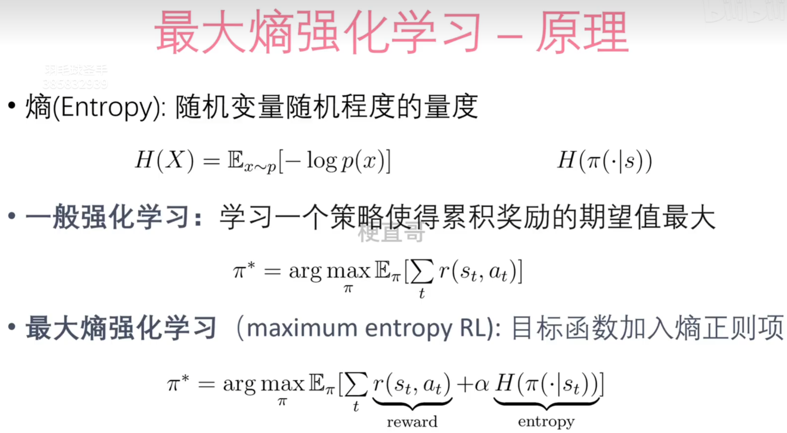
熵是对一个变量无序程度的度量，在目标函数加入熵正则项；最大熵强化学习的核心思想就是在最大化累计奖励的同时让策略更加随机，即输出的action的概率尽可能分散；
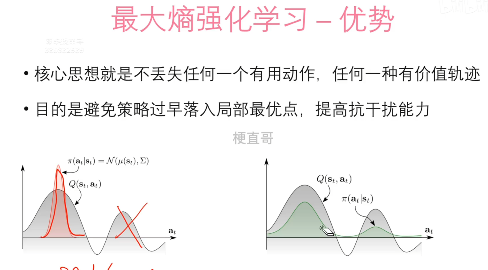
不丢失任何一个有价值的动作，任何有价值的轨迹
#### 损失函数
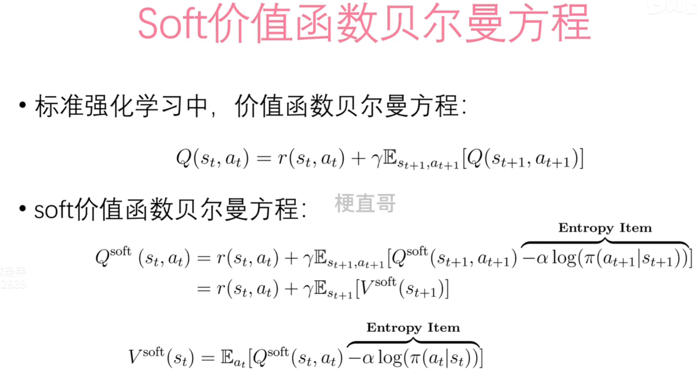
在热力学中，熵的最大化对应着系统叨叨热平衡的状态，而玻尔兹曼分布则描述了在这种平衡状态下能量分布的特性；或者说，玻尔兹曼分布是使得系统的熵最大化的概率分布，因此SAC方法借鉴了热力学理论，进一步提出了策略$\pi$应该符合玻尔兹曼分布。

上述式子把策略$\pi$用一个KL散度让它尽量逼近逗号右边的分布，其中Q函数的指数化操作是为了使其转化为一个概率分布，在保留各个动作相对差异的同时，Q值被转化为非负数，类似于热力学当中玻尔兹曼分布对能量进行指数化的操作，价值函数Q相当于能量energy，超参数$\alpha$的作用类似温度系数，用来调整峰的形状，分母Z是一个归一化因子，确保策略函数生成的动作概率之和为1。
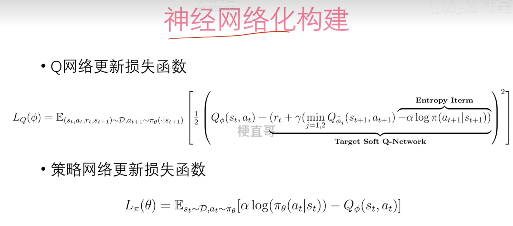
Q网络一般是几层MLP，最后输出一个单值来表示Q就可以了，policy网络需要输出一个分布，一搬输出一个高斯分布，包含均值和方差；对于Q网络的更新，也是构造了目标网络target soft Q网络，同时为了缓解Q值过高估计的问题，使用了两个Q网络，每次挑一个Q值较小的使用(j)，D表示经验池，即过去收集的数据，因为SAC是异策略的离线算法；对于policy网络参数的更新，上述式子可以看作是最小化与玻尔兹曼分布的KL散度。
#### 重参数化技巧
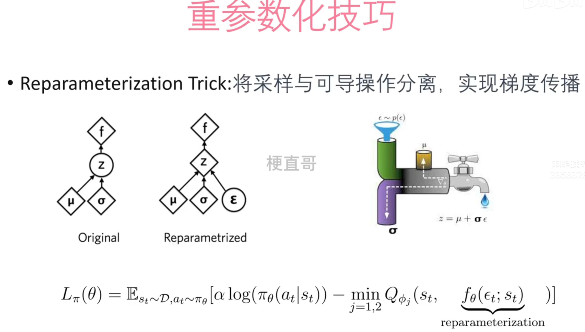
对于连续动作空间的环境，SAC算法策略网络输出的是高斯分布的均值和标准差，但是存在一个问题，高斯分布的采样动作是不可导的，因此需要使用重参数化技巧。在许多概率模型和变分推断中，随机性通常通过采样操作来引入，然而这种直接对目标分布进行随机采样得到随机性结果的操作是不可导的。以高斯分布为例，传统的采样操作是直接从均值和方差参数中采样出一个具体的值，而重参数化技巧将高斯分布的采样表示为一个确定性变换$z= \mu + \sigma * \epsilon$，其中z是采样的样本，$\mu$和$\sigma$是模型输出的均值和方差，$\epsilon$是服从均值为0，方差为1的正态分布，如此在梯度计算时就能对两个输出项进行求导，$\epsilon$属于额外参数项。
#### 自动化调整熵正则项
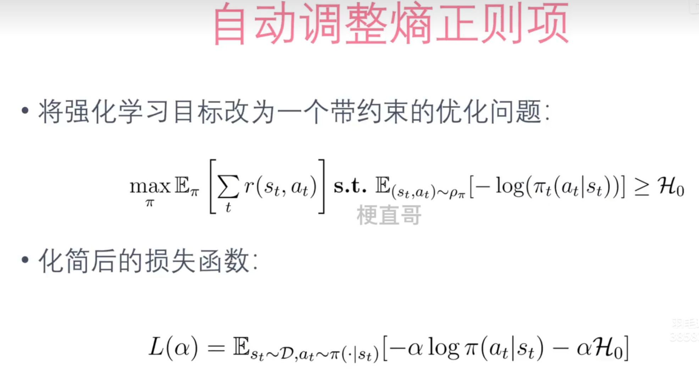
在训练过程中，不同状态下需要不同大小的熵，比如当最优动作不确定时，熵需要大一些，当某个最优动作比较确定时熵取值可以小一点。为了能够自动调整熵正则项，SAC将强化学习的目标改为一个带约束的优化问题：最大化期望回报的同时约束熵的均值大于H0，化简后可以得到关于正则项$\alpha$的损失函数$L(\alpha)$,当策略的熵低于目标值H0时，训练目标L会使得$\alpha$增大，增加策略中熵的重要性。具体实现时H0可取动作空间的对数，再取负值转换为最小化问题，
#### 算法步骤

#### 补充知识：玻尔兹曼分布、重参数化
SAC概述：https://blog.csdn.net/qq_41739364/article/details/135359200  
SAC与Soft Q-learning: https://blog.csdn.net/sinat_52032317/article/details/134230579   
```
class PolicyNetContinuous(torch.nn.Module):
    def __init__(self, state_dim, hidden_dim, action_dim, action_bound):
        super(PolicyNetContinuous, self).__init__()
        self.fc1 = torch.nn.Linear(state_dim, hidden_dim)
        self.mu = torch.nn.Linear(hidden_dim, action_dim)
        self.std = torch.nn.Linear(hidden_dim, action_dim)
        self.action_bound = action_bound

    def forward(self, x):
        x = F.relu(self.fc1(x))
        mu = self.mu(x)
        std = F.softplus(self.std(x))
        dist = torch.distributions.Normal(mu, std)
        normal_sample = dist.rsample()  # rsample()是重参数化采样
        log_prob = dist.log_prob(normal_sample) # 对dim个action每个单独计算其采样值的对数概率密度
        action = torch.tanh(normal_sample)
        # 计算tanh_normal分布的对数概率密度
        log_prob = log_prob - torch.log(1 - torch.tanh(action).pow(2) + 1e-7) # 雅可比修正,用于处理‌tanh变换对动作概率密度的影响
        action = action * self.action_bound
        return action, log_prob
```
SAC中输出的mu和std是一个动作对应一个，即在SAC中，每个动作通常是独立采样的，每个动作对应一个正态分布；对于连续动作空间，每个动作的概率密度是独立的，因此dim个动作的联合概率密度是各自概率密度的乘积；由于每个动作的概率密度函数在(-∞,∞)上的积分已经为1，dim个独立动作的联合概率密度在(-∞,∞)^dim上的积分也是1  

玻尔兹曼分布由来：  
Soft Q-learning: https://zhuanlan.zhihu.com/p/149091823  
https://zhuanlan.zhihu.com/p/664534945  
本质就是在损失函数中加入了熵正则项，玻尔兹曼分布是加入熵正则项的理论支持    
重参数化：https://blog.csdn.net/qq_45190012/article/details/144721894  
gumbel softmax：https://zhuanlan.zhihu.com/p/520413399  
次梯度：https://zhuanlan.zhihu.com/p/97465608  
(推)重参数方法探讨：https://zhuanlan.zhihu.com/p/561328468  
y_soft 是经过Gumbel噪声处理和温度参数控制的连续近似分布,由于y_soft是连续且可微的，在反向传播时，梯度可以通过它顺畅地流向模型参数，从而实现端到端的训练。y_hard 是通过对 y_soft 应用 argmax 操作得到的one-hot向量，表示真正的离散采样结果，是一个离散的、不可导的结果。即使不对它使用detach()，由于argmax本身的不可导性，梯度也无法通过它反向传播。实际上，y_hard在计算图中更像是一个"终点站"——它接收来自y_soft的信息，但本身不产生梯度路径。因此，无论是否显式地对y_hard使用detach()，都不会影响梯度流，因为argmax已经天然阻断了梯度。通过y_soft.detach()，我们创建了一个与计算图分离的y_soft副本。这样在前向计算差值y_hard - y_soft.detach()时，这个差值部分不会产生梯度，确保了梯度只通过右侧的y_soft流动。
## 基于模型的强化学习算法

在基于模型的强化学习算法中，状态转移通常是从真实环境中收集经验数据来得到，通过分析和建模可以估计状态转移的概率分布；具体有几种常见的方法：第一种是直接建模，在某些问题当中可以直接从环境中观察到状态转移的概率分布，比如deepMind的gym环境，状态转移概率是已知的，第二种是经验采样，智能体与真实环境进行交互，收集一系列的经验数据，通过对经验数据进行统计分析可以估计状态转移的概率分布；第三种....

### Dyna-Q算法(1990)  
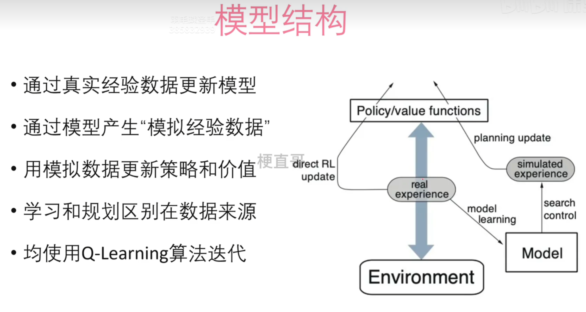
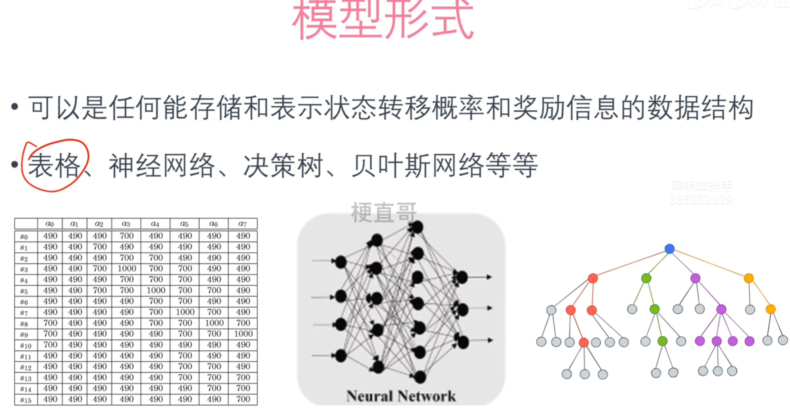
#### 算法步骤
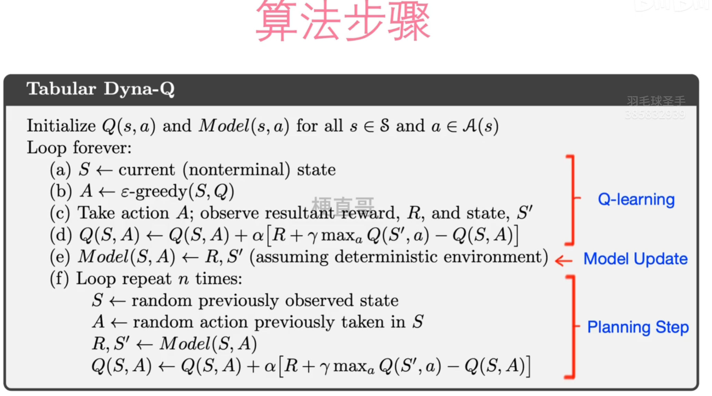
整个过程可以看作两个循环步骤，外循环用的是智能体和真实环境的交互轨迹，同时更新环境模型，首先根据当前的状态S和策略应用贪心算法选择动作A,然后执行该动作，观测奖励r和下一时刻状态，并更新动作价值函数；内循环是利用环境模型生成的模拟数据(随机选择之前观测到的状态动作对)，利用q-planning的方法不断优化动作价值函数(实质上是利用旧经验数据进行多步的Q学习).
#### 算法变体 Dyna-Q+  

Dyna-Q有一个强假设：环境是固定不变的，因此当环境是变化的，新模型还没有学习到，那模型就是错的。
Dyna-Q+在探索未知状态时给予额外的奖励，具体来说使用一个探索的计数器跟踪每个状态动作对被访问的次数；比如原来某个状态转移过程的reward是R，这个转移过程自上次访问到现在经过了t,就把该转移过程的reward设置为$R+\sqrt t$。
#### 适用条件
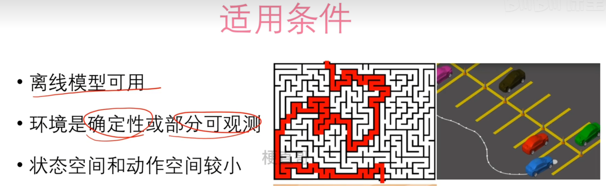
### MBPO(基于模型的策略优化，Model-Based Policy Optimization,2021) 


模型框架和DynaQ算法类似，只不过价值函数更新采用SAC算法替换q-learning，环境模型采用神经网络来学习逼近状态转移分布替代确定性字典，此外，状态的起始点以真实环境样本作为分支推演的起点，向前预测推演k步；整体使用了三类神经网络：环境模型状态转移网络、soft价值函数网络和soft策略网络。
#### 环境模型


先假定单个环境模型为高斯分布，输入为动作状态对，输出为高斯均值和方差；考虑到实际模型可能不是高斯分布，采用集成学习思想，简单来说就是构建了多个神经网络，输入都是动作状态对，输出都是下一个状态的高斯分布的均值向量和协方差矩阵，只是参数采用不同的随机初始化，而且每次训练时都是从真实数据中随机采样不同的数据进行训练，这种方法叫带有轨迹采样的概率集成。
#### 算法步骤
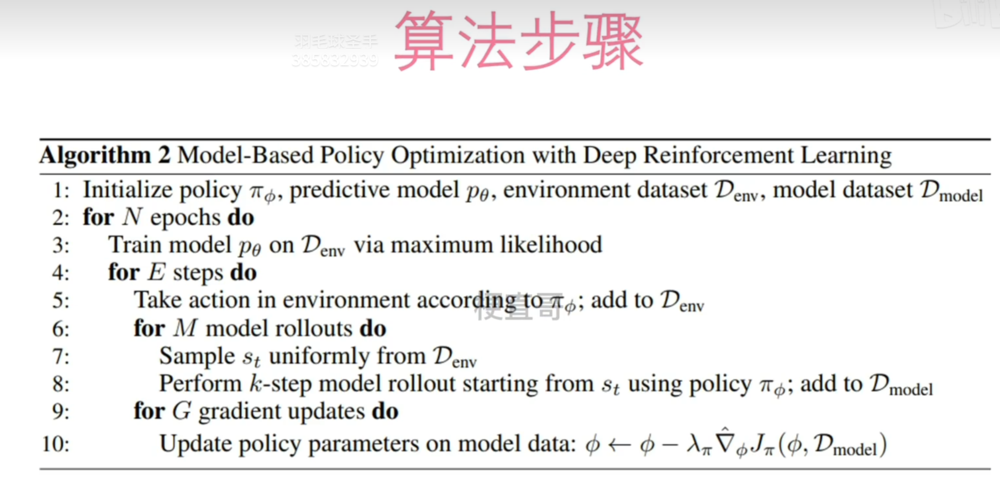
首先初始化策略环境模型参数、真实的环境数据集以及模型数据集，然后进入第一个迭代循环，首先在环境数据集上通过最大似然方法训练环境模型参数，然后进入时间步的循环，根据当前的策略执行动作并将与环境交互的轨迹添加到环境数据集中，然后对M个模型分别进行预测推演，其中先从环境数据集中均匀随机采样一个状态ST作为起始点，然后使用当前的策略进行k步模型推演，再把生成的轨迹数据添加到模型数据集中，然后基于模型数据适用SAC算法更新策略网络参数。
```
 # 定义损失函数，接收预测的均值和log方差以及真实的标签
def loss(self, mean, logvar, labels):
    # 计算方差的倒数，用来作为损失函数的一个权重，增加方差较小的样本的重要性
    inv_var = torch.exp(-logvar)
    
    # 计算预测均值与真值的loss
    mean_loss = torch.mean(torch.mean(torch.pow(mean - labels, 2) * inv_var, dim=-1), dim=-1)
    # 方差loss
    var_loss = torch.mean(torch.mean(logvar, dim=-1), dim=-1)
    # 求和后返回
    total_loss = torch.sum(mean_loss) + torch.sum(var_loss)
    return total_loss, mean_loss
```
上述代码是环境模型的损失函数，模型的输出是每个状态和reward(默认为1)的均值和方差，均值直接和label真值作差求损失，方差一方面作为均值损失的额外权重，增加较小方差(结果更确定更置信)的样本的损失反馈权重，另一方面通过最小化方差驱使模型根据确定性。
选择结果时是从多个模型中随机选择一个模型结果。 
(内容较多)代码实现：https://gitee.com/Gengzhige/Reinforcement-Learning/blob/master/Chapter-10/10.5%20MBPO%E7%9A%84%E4%BB%A3%E7%A0%81%E5%AE%9E%E7%8E%B0.ipynb  
## 模仿学习

深度学习尤其是监督学习训练数据需要标签，虽然强化学习不需要标签数据，但它高度依赖于奖励函数的设定，微小的奖励函数改动有时会训练出截然不同的策略。在许多实际场景中，奖励函数没有被明确的定义或者奖励信号非常稀疏，这种情况下，随机设计奖励函数不能确保训练出的策略一定符合实际的需求，模仿学习则避开了这个难题，它假设有专家示范与环境进行交互，无需奖励信号就可以直接从专家交互的状态和动作数据中模仿得到最优策略。  
### 行为克隆

行为克隆是一种直接使用监督学习方法的技术，将专家数据中的状态和对应的动作对作为训练样本，状态视为输入，动作视为标签。

### 逆强化学习  

先学习环境的奖励函数，暂时不考虑状态转移模型，可以用一个神经网络来逼近实现，输入是专家示范的轨迹，包括状态和动作的序列，输出是一个近似的奖励函数，损失函数最常见的是最大熵损失函数。
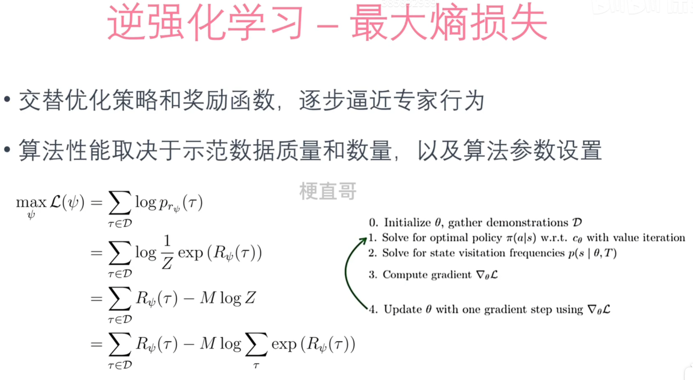
D表示收集到的轨迹数据集，t表示其中的某条轨迹，r表示参数化的奖励函数，Z是r的指数函数求和，M是示范数据的数量。最大熵逆强化学习是一个迭代的过程。通过交替优化策略和奖励函数，逐步逼近专家行为。

### 生成对抗式模仿学习  

判别器的目标是将专家数据的输出靠近0，策略网络的数据靠近1；其优点是从专家示范中学习，无需奖励信号，支持多元化的生成策略，缺点是训练不稳定，十分依赖专家示范数据。  
## 多智能体强化学习
当多个智能体与环境进行交互时，整个系统就变成了多智能体的系统，其中每个智能体仍然遵循强化学习的目标，即最大化累计奖励，所有智能体根据当前的环境状态同时选择并执行各自的动作。这些动作有影响了环境状态的转移和更新。  

$\pi^{-i}$表示在给定其他智能体策略的情况下智能体i的策略。在多智能体强化学习中，纳什均衡就是多个智能体达到的一种平衡点，对于其中的任何一个智能体来说，没办法通过采取其他的策略来获取更到的回报；纳什均衡不一定是全局最优，但他在概率上是最容易产生的一种结果，是在学习时比较容易收敛到的一种状态。  
智能体兼的关系分为竞争关系、半竞争半合作混合关系以及完全合作关系，不同的关系类型直接决定了多智能体问题的建模和求解方法。  
### 完全竞争关系Minmax Q learning：  

最优价值函数的目标是对于一个智能体i,考虑在其他的智能体i-采取动作a-令自己回报最差的情况下能够获得的最大的期望回报。其中V和Q省略了智能体i的下标，这是因为在零和博弈中，设定Q1=-Q2，因此目标函数是对称的，这个价值函数表明当前智能体在考虑对手策略的情况下使用贪心选择使得智能体容易收敛到纳什均衡策略。  
### 混合关系Nash Q-learning:  
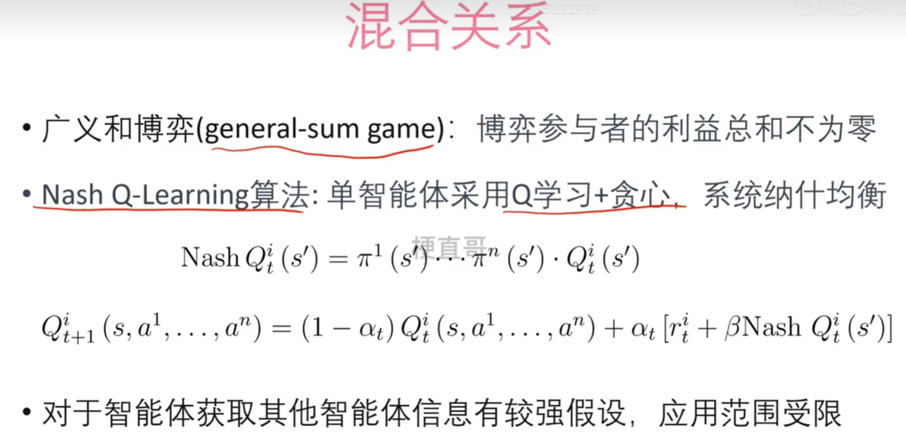
一个博弈中各个参与者的总和不为0，参与者的收益有正有负，每个智能体都是贪心Q-learning方法，一个智能体i的Nash Q值定义为其他智能体的策略$\pi$乘以当前智能体的Q值，同时Q值使用nash Q值迭代更新。因此对于单个智能体i，除了要知道全局状态s和其他智能体动作A以外，还需要知道其他所有智能体在下一状态对应的nash均衡策略$\pi$,因此nash q learning方法对智能体能够获取的智能体的信息包括动作奖励等都具有较强的假设。在复杂的真实环境中，一般不满足这样严格的条件，应用范围有限。
### 多智能体完全合作关系

### MADDPG:对每个智能体实现ddpg算法

中心化训练，去中心化执行

三层循环，最外层是episode，第二层是时间步的循环，第三层是agent的循环，开始先初始化一个随机过程N用于动作探索，获取所有智能体的初始观测X,然后在每个时间步中，对于每个智能体i用当前的策略选择一个动作a,执行动作并获得奖励a和新的观测r，然后把$(X, a, r, X')$存储到经验回放池D中，然后针对每个智能体i从D中随机的采样一些数据，然后中心化的训练critic网络(Q网络)，训练自身的actor网络(策略网络)，最后对于每个智能体i更新目标actor网络和目标critic网络。 
Simple Spread： 每个圆球都能坐到椅子上，并且不互相发生碰撞，agent默认是3个,动作维度是5，分上下左右和无动作，动作值上下限为0-1，观测状态是18位的向量，包含了agent当前的速度、位置、与椅子之间的相对位置、与其他agent的相对位置等，state是3个agent的特征向量之后共54个。
### AlphaStar系统  

首先模型接收来自游戏的观察数据，包括游戏的地图、单位的位置属性等等，通过卷积神经网络CNN进行处理和特征提取，用来捕捉地图和单位间的空间关系和重要的特征，即状态state，接着智能体经过一系列的网络模块和注意力的机制，生成动作策略。

第一步是使用人类的数据做有监督的预训练，学习的目标就是给定一个状态，预测下一步的动作，然后与真实的动作A之间求一个KL散度做损失函数，第二步就是强化学习，以人类监督学习的数据来初始化状态，具体的强化学习算法用了A3C算法，使用了经验回放池，最后在决策层的设计上融合了多个方法，其中V-Trace技术deepMind团队在其强化学习框架IMPALA使用的一种方法，它已经被证明在大规模并行环境下能够有效地进行深度的强化学习，具体是用来纠正off policy训练当中不同策略之间的差异，$TD(\lambda)$是时序差分，具体考虑了多个步骤的信息来更新价值的函数，还有一个UPGO(unsupervised predictive game outcome)，它是一个在模仿学习中使用的方法，目的是尽量选择能够达到收益较高轨迹的动作。

为了创建一个多样化的训练环境，增强智能体的泛化能力，AlphaStar同时训练了三个策略的集合，每个种族都有三个不同的策略集合，main agents为主要智能体，通过与其他智能体(包括自己的过去版本以及main explorers)对战来学习改进自己的策略，main exploers的对手是当前的main agents, 它们的任务是找到并利用这些main agents的策略漏洞，通过这种方式促使main engines去纠正这些漏洞；legal explorers的任务是找到并利用整个训练环境包括main agents和main explorers里面的策略漏洞，通过这种方式进一步的保证训练环境的多样性。
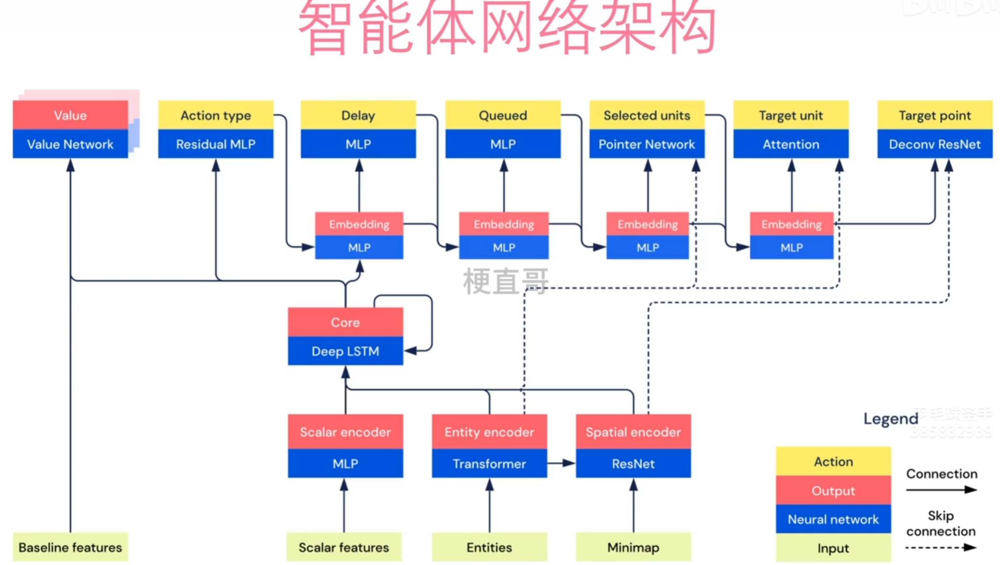
智能体网络架构是由通用的神经网络组件构成的，玩家和对手单位的观测结果通过自注意力机制或者transformer进行处理，ResNet和反卷积ResNet用来处理图片像素的信息，主要用在了minimap小地图编码和target point action的选择上；为了整合空间和非空间的信息，进一步引入了scatter connections，为了处理部分可观测性，观测结果的时间序列由深度长短期记忆系统deep LSTM来处理；为了管理结构化组合动作空间，又使用了自回归策略和递归指针网络。整体网络参数达到了1.39亿个，实际推理过程中只需要5500万个。

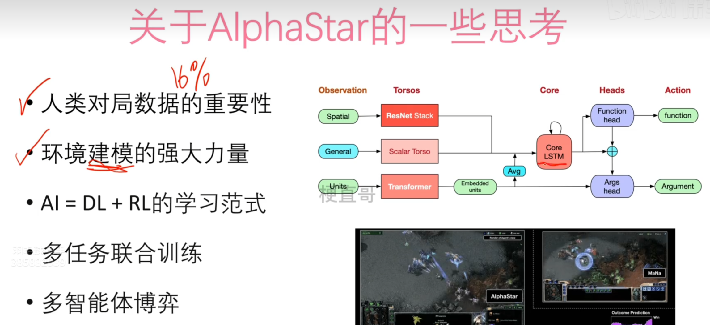
大量的人类对局数据是非常重要的，因为预训练完的agent智能体已经能够达到前16%的人类玩家的水平了，从论文消融实验看离开了预训练几乎很难训练出好的策略。  
## 基于人类反馈的强化学习RLHF
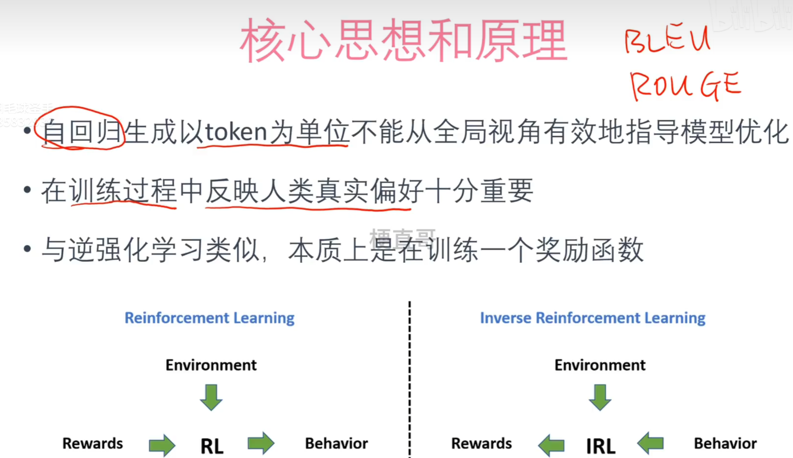
以语言模型为例，大部分采用了自回归生成的方式，通过递归解码的方式逐字或者逐词的产生内容，训练过程通常依赖于简单的根据上下文信息预测下一个词，然后用交叉熵计算每个词的损失，但这种以taken为单位的损失不能从全局视角有效地指导模型的优化。为了更加全局的评估模型的输出质量，常常使用BLEU、ROUGE等评价指标来衡量模型输入与人类偏好的一致性，然而这种做法仅仅用于评价结论，模型在训练的过程中并不能获取反应人类真实偏好的信息，因此在训练阶段直接使用人类的反馈来对模型的整体输出结果计算奖励或者损失更加合理。RLHF本质是训练一个奖励函数，这个奖励函数能投解释和预测人类给出的反馈从而引导强化学习算法的行为。和逆强化学习类似，两者都依赖于外部输入来学习奖励函数，只不过逆强化学习通常需要专家来演示，而RLHF可以使用非专家的更稀疏且噪声较大的反馈来进行学习。逆强化学习假设专家的行为是最优的，而RLHF不需要这个假设。
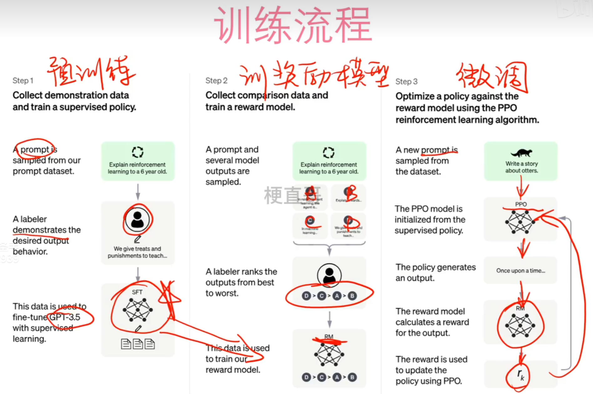
RLHF的训练过程主要包括三个步骤，首先预训练语言模型，然后第二步收集数据并训练奖励模型，最后通过强化学习对原模型进行微调。第一步是人工编写问题prompt以及对应的答案，并使用这些数据对一个gpt3模型进行精细的调整，这一步可以训练出多个版本的模型；第二步先根据多个模型生成多个问题的答案，然后人工专家会根据某些标准比如可读性、正确性等等，对这些问题和答案进行排序并训练一个奖励模型用于评分，最后在微调阶段使用强化学习来加训上述经过微调的GPT3模型，具体采用的PPO算法，根据prompt生成答案，再用第二步训练的到的奖励模型进行打分。

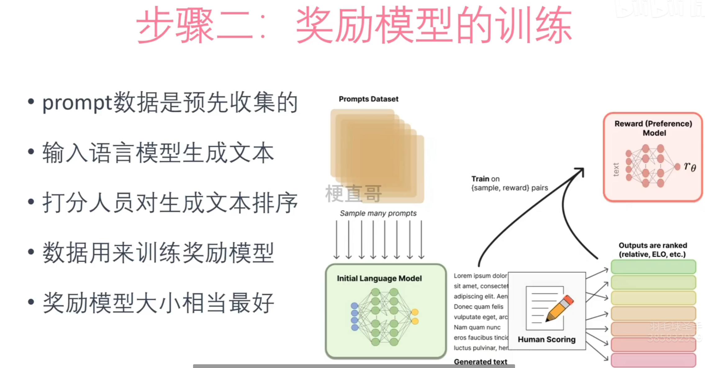
奖励模型可以看作是一种判别式的语言模型，可以使用一个预训练语言模型进行热启动。打分人员只对生成文本进行排序，不直接进行打分。
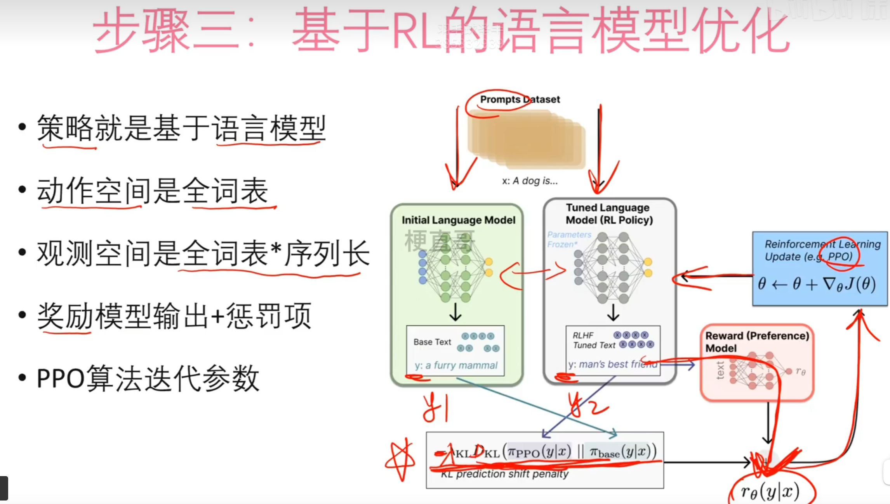
策略就是基于语言模型接收prompt作为输入，输出一系列的文本或者是文本的概率分布，动作空间就是全词表。两个对比模型的输出不能差太多，这会导致训练的步子太大，因此在损失函数中添加一个KL散度的约束项，用KL散度作为惩罚项。整体训练如下：首先采样预先收集的prompt数据做输入，同时喂给初始的语言模型和当前训练中的语言模型，得到两个模型的输出y1和y2，然后用奖励模型RM对y1和y2进行打分判断谁更优秀，打分的差值作为训练策略模型参数的信号，通过KL散度来计算奖励或者惩罚的大小，最后根据PPO来更新模型的参数。

大模型训练项目:[LLaMA-Efficient-Tuning](https://github.com/hiyouga/LLaMA-Factory?tab=readme-ov-file)